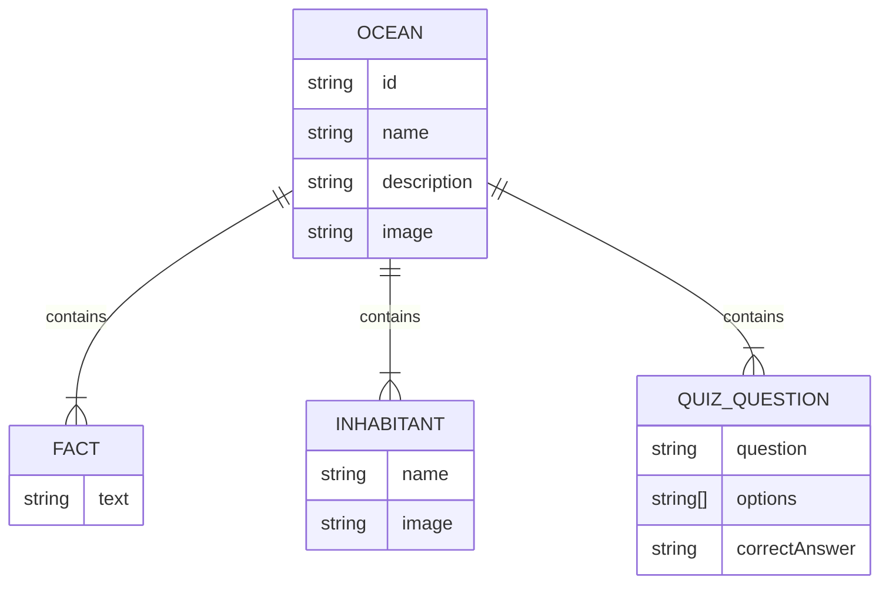

****

Abschlussprüfung “Angular” NE4NE8

Fachinformatiker für Anwendungsentwicklung

Dokumentation zur Kurs-Projektarbeit

# **Earth Oceans Learning APP**

Entwicklung einer kindgerechten Angular SPA zur Vermittlung von Wissen über die 5 Ozeane für Kinder (7-9 Jahre)

Abgabe der Dokumentation: 09.12.2025

Prüfling:

Tobias Boyke

Musterstraße 1

40470 Düsseldorf

Prüfungsnummer:  0001278495 

****

Ausbildungsbetrieb:

Beispiel GmbH

Firmenweg 2

41460 Neuss

## **Inhaltsverzeichnis**

[1\. Einleitung	5](#1\.-Einleitung)

[1.1. Ausgangssituation	5](#1.1.-Ausgangssituation)

[1.2. Projektidee und Zielsetzung	5](#1.2.-Projektidee-und-Zielsetzung)

[1.3 Projektbegründung	5](#1.3-Projektbegründung)

[2\. Projektplanung	6](#heading=)

[2.1 Ist-Analyse	6](#heading=)

[2.2. Zeitplanung (Gantt-Diagramm)	6](#2.2.-zeitplanung-\(gantt-diagramm\))

[2.3 Zeitplanung	7](#heading=)

[2.4 Kostenplanung	8](#heading=)

[3\. Analyse & Entwurf	9](#heading=)

[3.1 Anwendungsfalldiagramm (Use Cases)	9](#heading=)

[3.2 Architekturentwurf	10](#heading=)

[3.3 UI/UX Design	11](#heading=)

[3.4 Datenmodell	12](#3.4-datenmodell)

[3.5 Klassendiagramm (UML)	13](#3.5-klassendiagramm-\(uml\))

[3.6 Datenschutz & Sicherheit (Privacy by Design)	14](#3.6-datenschutz-&-sicherheit-\(privacy-by-design\))

[4\. Realisierung	14](#4.-realisierung)

[4.1 Entwicklungsumgebung	14](#4.1-entwicklungsumgebung)

[4.2 Implementierung der Hauptkomponenten	14](#4.2-implementierung-der-hauptkomponenten)

[4.2.1 Standalone Components	14](#4.2.1-standalone-components)

[4.2.2 State Management mit SignalStore	15](#heading=)

[4.2.3 Routing & Navigation	15](#4.2.3-routing-&-navigation)

[4.3 Herausforderungen & Lösungen	16](#4.3-herausforderungen-&-lösungen)

[5\. Qualitätssicherung	17](#5.-qualitätssicherung)

[5.1 Testplanung	17](#5.1-testplanung)

[5.2 Testdurchführung & Ergebnisse	17](#heading=)

[6\. Wirtschaftlichkeitsbetrachtung	18](#heading=)

[6.1 Soll-Ist-Vergleich (Zeit)	18](#heading=)

[6.2 Nachkalkulation (Kosten)	18](#heading=)

[6.3 Amortisationsrechnung	19](#6.3-amortisationsrechnung)

[7\. Fazit & Ausblick	19](#7.-fazit-&-ausblick)

[7.1 Zusammenfassung	19](#7.1-zusammenfassung)

[7.2 Lessons Learned	19](#7.2-lessons-learned)

[7.3 Ausblick	20](#7.3-ausblick)

[8\. Anhang	21](#heading=)

[8.1. Quellcode und Dateien	21](#heading=)

[8.2. Mockups und Screenshots	21](#heading=)

[7\. Erklärung	22](#heading=)


## **Abbildungsverzeichnis**

[2.3 Zeitplanung \- Gantt Diagramm 09](#heading=)

[3.1 Anwendungsfalldiagramm (Use Cases)	10](#heading=)

[3.2 Architekturentwurf	11](#heading=)

[3.4 Datenmodell	13](#heading=)

[3.5 Klassendiagramm (UML)	14](#heading=)

## **Tabellenverzeichnis** {#tabellenverzeichnis}

[2.3 Zeitplanung	08](#heading=)

[4.3 Herausforderungen & Lösungen	17](#heading=)

[5.2 Testdurchführung & Ergebnisse	18](#heading=)

[6.1 Soll-Ist-Vergleich (Zeit)	19](#heading=)

## **Listings** {#listings}

[3.4 Datenmodell 13](#heading=)

[4.2.1 Standalone Components 15](#heading=)

[4.2.2 State Management mit SignalStore 16](#heading=)

[5.1 Testplanung 18](#heading=)

## **Glossar**

| Begriff | Erklärung |
| ----- | ----- |
| SPA | Single Page Application \- Eine Webanwendung, die technisch aus einer einzigen HTML-Seite besteht. Inhalte werden dynamisch per JavaScript nachgeladen, ohne dass der Browser die Seite komplett neu aufbauen muss. Dies sorgt für ein flüssiges, App-ähnliches Nutzererlebnis. |
| Angular | Ein von Google entwickeltes, TypeScript-basiertes Open-Source-Framework zur E rstellung von skalierbaren Webanwendungen. Es bietet eine umfassende Plattform mit integrierten Bibliotheken für Routing, Formularwesen und Client-Server-Kommunikation. |
| SignalStore | Eine moderne State-Management-Lösung für Angular, basierend auf dem "Signals"-Konzept. Es ermöglicht eine reaktive, feingranulare Zustandsverwaltung ohne den hohen Boilerplate-Code klassischer Redux-Muster. |
| Standalone Component | Ein Architekturkonzept in Angular, bei dem Komponenten, Direktiven und Pipes nicht mehr in NgModules deklariert werden müssen. Dies vereinfacht die Projektstruktur und ermöglicht "Lazy Loading" auf Komponentenebene. |
| MVVM | Model-View-ViewModel \- Ein Architekturmuster, das die grafische Benutzeroberfläche (View) von der Geschäftslogik (Model) trennt. Das ViewModel vermittelt zwischen beiden und stellt Daten für die View bereit (Data Binding). |
| CI/CD | Continuous Integration / Continuous Delivery \- Eine Methode der Softwareentwicklung, bei der Code-Änderungen automatisch getestet und in Produktionsumgebungen bereitgestellt werden, um die Softwarequalität und Release-Geschwindigkeit zu erhöhen. |
| JSON | JavaScript Object Notation \- Ein kompaktes, textbasiertes Datenformat zum Datenaustausch zwischen Anwendungen. Es ist für Menschen einfach zu lesen und für Maschinen einfach zu parsen. |
| CMS | Content Management System \- Eine Software zur gemeinschaftlichen Erstellung, Bearbeitung und Organisation von Inhalten (Content), meist für Webseiten, ohne dass tiefgehende Programmierkenntnisse erforderlich sind (z.B. GRAV, WordPress). |
| Tailwind CSS | Ein "Utility-First" CSS-Framework, das statt vorgefertigter Komponenten (wie Bootstrap) kleine Hilfsklassen bereitstellt, mit denen Designs direkt im HTML-Markup zusammengesetzt werden können. |
| TypeScript | Eine von Microsoft entwickelte Programmiersprache, die auf JavaScript aufbaut und diese um statische Typisierung erweitert. Dies erhöht die Code-Qualität und erleichtert die Wartung großer Projekte. |
| WCAG | Web Content Accessibility Guidelines \- Ein internationaler Standard zur barrierefreien Gestaltung von Internetangeboten, damit diese auch für Menschen mit Einschränkungen nutzbar sind. |
| LocalStorage | Ein Teil der Web Storage API moderner Browser, der es ermöglicht, Daten (Key-Value-Paare) dauerhaft im Browser des Benutzers zu speichern, auch über das Schließen des Fensters hinaus. | 

## **1\. Einleitung**

### **1.1. Ausgangssituation**

Im Rahmen der Umschulung zum Fachinformatiker für Anwendungsentwicklung, erläutert der Autor, welcher bei Herrn Ehlen sein Kurs-Element “Angular” absolvierte, den Ablauf seines hier folgenden Abschlussprojekts **bei einem fiktiven** Unternehmen.

Die **Beispiel GmbH** ist ein etabliertes, mittelständisches IT-Dienstleistungsunternehmen mit Sitz im Herzen von Neuss. Seit ihrer Gründung im Jahr 2025 hat sich die Firma darauf spezialisiert, maßgeschneiderte Webanwendungen und anspruchsvolle CMS-Lösungen für Unternehmenskunden zu entwickeln. **14 Mitarbeiter**, bestehend aus Backend- und Frontend-Entwicklern, UI/UX-Designern, Projektmanagern und Content-Spezialisten, sind in der Beispiel GmbH beschäftigt und arbeiten vorwiegend für Kunden aus dem produzierenden Gewerbe, der Logistik und der Edutainment-Branche.

Die Beispiel GmbH wurde von einem Kunden, einer Umweltschutz-NGO, beauftragt, eine Browser Applikation für das spielerische Erlernen von Ozean-Fakten für Grundschulkinder zu entwickeln.

 Zu den Stakeholdern des Projekts zählen:

* Der Auftraggeber (NGO): Vertreten durch Herrn Dr. Uwe Umwelt.

### **1.2. Projektidee und Zielsetzung**

Ziel des Projektes ist die Entwicklung einer Single Page Application (SPA) "Earth Ocean Learning". Die Anwendung soll Kindern spielerisch Wissen über die fünf Ozeane vermitteln. Kernfunktionen umfassen eine Auswahl der Ozeane, einen Lernbereich mit Informationen sowie ein Quiz-Modul zur Wissensüberprüfung.Optional soll die Anwendung muss als eigenständiges Modul (Standalone) konzipiert sein, um eine einfache Integration in bestehende CMS-Systeme (wie GRAV) zu ermöglichen.

### **1.3 Projektbegründung**

Die Digitalisierung im Bildungssektor erfordert moderne, webbasierte Lernlösungen, die plattformunabhängig funktionieren. Herkömmliche Lernmaterialien (PDFs, statische Webseiten) bieten oft nicht den nötigen Anreiz für die Zielgruppe (Kinder). Durch den Einsatz moderner Webtechnologien (Angular, SignalStore) soll eine performante, wartbare und zukunftssichere Lösung geschaffen werden, die gleichzeitig als Referenzprojekt für die Beispiel GmbH dient, um die Kompetenz im Bereich "Edutainment" zu unterstreichen.

## **2\. Projektplanung**

### **2.1 Ist-Analyse**

Zum Zeitpunkt des Projektstarts existiert keine Softwarelösung für den genannten Anwendungsfall. Die Inhalte (Texte, Bilder zu Ozeanen) liegen lediglich in unstrukturierter Form (Textdokumente, Bilddateien) vor. Es gibt keinen bestehenden Codebase, auf dem aufgebaut werden kann ("Greenfield Project").

**Technische Ausgangslage:**

* Entwickler-Workstation mit Windows 11 und Rocky Linux 10\.  
* Zugriff auf Standard-Entwicklungstools (VS Code, Sublime Text 4 (Build 4200), GitHub, Node.js, NPM.  
* Keine bestehende CI/CD Pipeline für dieses spezifische Projekt.

### **2.2. Zeitplanung (Gantt-Diagramm)**

Es soll eine Webanwendung entwickelt werden, die folgende Anforderungen erfüllt:

**Funktionale Anforderungen:**

* **Ozean-Auswahl:** Visuelle Darstellung und Auswahl der 5 Weltmeere.  
* **Lernmodus:** Anzeige von Fakten und Bewohnern pro Ozean (Carousel/Slider).  
* **Quiz-System:** Multiple-Choice Fragen mit direktem Feedback.  
* **Fortschritt:** Speicherung des Lernfortschritts (Sterne-System) im lokalen Browser-Storage (kein Backend-Zwang).  
* **Master-Quiz:** Ein freischaltbarer Modus nach Abschluss aller Ozeane.

**Nicht-funktionale Anforderungen:**

* **Zielgruppe:** Kindgerechtes UI/UX (große Buttons, wenig Text, viel Bild).  
* **Technologie:** Angular 21 (aktuellste Version), Nutzung von Standalone Components.  
* **State Management:** Nutzung von Angular Signals / SignalStore für reaktives Datenmanagement.  
* **Performance:** Kurze Ladezeiten, optimierte Assets.  
* **Responsive Design:** Lauffähig auf Tablets und Desktops.

### **2.3 Zeitplanung**

Der Durchführungszeitraum des Projektes ist vom 17.11.2025 bis 09.12.2025. Die geplante Gesamtzeit beträgt 70 Stunden.

| *Phase* | *Tätigkeit* | *Geplante Zeit (h)* |
| ----- | ----- | :---: |
| *1\. Analyse & Planung* |  | *11 h* |
|  | *Ist-Analyse & Soll-Konzept* | *3 h* |
|  | *Erstellung Pflichtenheft / Fachkonzept* | *4 h* |
|  | *Wirtschaftlichkeitsbetrachtung (Planung)* | *2 h* |
|  | *Zeit- & Ressourcenplanung* | *2 h* |
| *2\. Entwurf* |  | *12 h* |
|  | *UI/UX Design (Mockups)* | *5 h* |
|  | *Software-Architektur & Datenmodellierung* | *4 h* |
|  | *Auswahl der Bibliotheken & Tools* | *3 h* |
| *3\. Implementierung* |  | *28 h* |
|  | *Aufsetzen der Entwicklungsumgebung* | *2 h* |
|  | *Implementierung Core-Komponenten & Routing* | *6 h* |
|  | *Implementierung Logik (SignalStore, Services)* | *8 h* |
|  | *Implementierung UI & Styling (Tailwind)* | *8 h* |
|  | *Integration der Daten (JSON)* | *4 h* |
| *4\. Qualitätssicherung* |  | *9 h* |
|  | *Erstellung von Testfällen* | *3 h* |
|  | *Durchführung Tests & Bugfixing* | *6 h* |
| *5\. Dokumentation* |  | *10 h* |
|  | *Erstellung Projektdokumentation* | *8 h* |
|  | *Erstellung Benutzerhandbuch* | *2 h* |
| ***Gesamt*** |  | ***70 h*** |


### **2.4 Kostenplanung**

Die Kostenplanung **basiert auf einem fiktiven** internen Verrechnungssatz.

**Personalkosten:**

* Stundensatz (Auszubildender/Junior): 50,00 €  
* Geplante Stunden: 70 h  
* **Summe Personal:** 70 h \* 50,00 €/h \= 3**.500,00 €**

**Sachmittelkosten:**

* Nutzung vorhandener Hardware/Software (anteilig): pauschal 150,00 €  
* Lizenzen (Open Source): 0,00 €  
* **Summe Sachmittel: 150,00 €**

**Gesamtkosten (Plan): 3.650,00 €**

## **3\. Analyse & Entwurf**

### **3.1 Anwendungsfalldiagramm (Use Cases)**

Der Benutzer (Kind) interagiert primär lesend und spielend mit dem System.


### **3.2 Architekturentwurf**


**Technologie-Entscheidungen:**

**Angular 21:** In Absprache mit dem Ausbilder wurde die Entscheidung getroffen, die Version 21 zu verwenden. Ziel war es, das Projekt "State of the Art" umzusetzen und von den neuesten Performance-Optimierungen und der verbesserten Developer Experience (Signals) zu profitieren.

**SignalStore (@ngrx/signals):** Leichtgewichtiges State Management, ideal für die Komplexität der Anwendung, ohne den Boilerplate von Redux.

**Tailwind CSS:** Utility-First CSS Framework für schnelles Styling und einfache Responsivität.

### **3.3 UI/UX Design**

Das Design wurde speziell für Kinder entwickelt:

* Farbpalette: Helle, freundliche Farben (Blau-, Türkis- und Sandtöne im Thema Ozean.  
* Typografie: Gute Lesbarkeit durch serifenlose Schriftarten.  
* Navigation: Große Knöpfe, intuitive "Weiter"-Buttons, visuelles Feedback bei Quiz-Antworten (Grün/Rot).  
* Barrierefreiheit (Accessibility): Einhaltung grundlegender WCAG-Standards, wie z.B. ausreichende Farbkontraste für Texte und Buttons sowie Tastaturnavigation (Tab-Index) für eine bedienbare Oberfläche auch ohne Maus.

### **3.4 Datenmodell**

Die Daten werden in einer JSON-Struktur gehalten, um Flexibilität zu gewährleisten und eine Datenbank-Abhängigkeit für diesen Prototypen zu vermeiden.

```json
{
  "id": "pacific",
  "name": "Pazifischer Ozean",
  "facts": [ ... ],
  "inhabitants": [ ... ],
  "quizQuestions": [
    {
      "question": "Wie tief ist der Marianengraben?",
      "options": ["11.000m", "5.000m", "2.000m", "8.000m"],
      "correctAnswer": "11.000m"
    }
  ]
}
```
### **3.5 Klassendiagramm (UML)**

Das Klassendiagramm verdeutlicht die Abhängigkeiten zwischen den Standalone Components, dem SignalStore und den Daten-Services.


### **3.6 Datenschutz & Sicherheit (Privacy by Design)**

Da sich die Anwendung an Kinder richtet, hat der Datenschutz höchste Priorität.

* Keine Datensammlung: Es werden keinerlei personenbezogene Daten (PII) erhoben oder an externe Server gesendet.  
* Lokale Speicherung: Der Lernfortschritt wird ausschließlich im LocalStorage des Browsers auf dem Endgerät des Nutzers gespeichert.  
* Offline-Fähigkeit: Die Anwendung lädt keine externen Tracker oder Analyse-Tools nach.  
* *Das Klassendiagramm detailliert die Struktur der JavaScript-Module. Die Hanoi Visualizer-Klasse kapselt die gesamte Canvas-Logik. solver.js stellt eine reine Funktion bereit, während hanoi-main.js als Controller agiert.*

## **4\. Realisierung**

### **4.1 Entwicklungsumgebung**

Die Entwicklung fand auf einem lokalen Windows-System statt. Folgende Tools kamen zum Einsatz:

* **IDE:** Visual Studio Code mit Angular Language Service.  
* **Versionierung:** Github (Globales Privates Repository).  
* **Framework:** Angular CLI Version 21.0.0.  
* **Browser:** Google Chrome (für Debugging und Tests).

### **4.2 Implementierung der Hauptkomponenten**
#### **4.2.1 Standalone Components**

Das Projekt setzt vollständig auf Standalone Components, um die Komplexität von NgModules zu vermeiden. 

```typescript
@Component({
  selector: 'app-ocean-facts',
  standalone: true,
  imports: [CommonModule, NgOptimizedImage],
  templateUrl: './ocean-facts.component.html',
  styleUrl: './ocean-facts.component.css',
  changeDetection: ChangeDetectionStrategy.OnPush
})
export class OceanFactsComponent { ... }
```

*Die OceanFactsComponent, die alle notwendigen Abhängigkeiten (Imports) direkt im Component-Decorator definiert*

#### **4.2.2 State Management mit SignalStore**

Für die Verwaltung des Anwendungszustands (z.B. "Welcher Ozean ist gewählt?", "Wie viele Sterne hat der User?") wurde der **NgRx SignalStore** verwendet. Dies ermöglicht eine reaktive und performante Datenhaltung ohne den Boilerplate klassischer Redux-Lösungen. 

```typescript
export const QuizStore = signalStore(
  { providedIn: 'root' },
  withState(initialState),
  withMethods((store) => ({
    unlockMasterQuiz() {
      patchState(store, { masterQuizUnlocked: true });
    },
    addStar(oceanId: string) {
      // Logik zum Hinzufügen eines Sterns
    }
  }))
);
```

*Der Store (QuizStore) hält den State und bietet Methoden (Updaters) zur Manipulation an*

#### **4.2.3 Routing & Navigation**

Das Routing wurde in der app.routes.ts definiert. Es ermöglicht die Navigation zwischen Startseite, Auswahl, Fakten und Quiz. Parameter (wie die id des Ozeans) werden über die URL übergeben (path: 'facts/:id') und in den Komponenten ausgelesen.


### **4.3 Herausforderungen & Lösungen**

Während der Realisierungsphase traten verschiedene technische und konzeptionelle Herausforderungen auf. Diese wurden wie folgt gelöst:

| Herausforderung | Lösungsansatz | Ergebnis |
| ----- | ----- | ----- |
| Persistierung des Fortschritts Datenverlust beim Neuladen der Seite (F5). | Implementierung eines LocalStorageService, der den State des SignalStores bei jeder Änderung speichert und beim App-Start wiederherstellt.	 | Lernfortschritt (Sterne) bleibt dauerhaft erhalten.  |
| Code-Qualität / Linting Inkompatibilität von ESLint mit Angular 21 (RC). | Verzicht auf automatisierte Linter. Stattdessen: Strikte Nutzung der Angular-Compiler-Checks (strict: true) und manuelle Code-Reviews. | Hohe Code-Qualität durch Disziplin, keine Build-Fehler. |
| SignalStore Einarbeitung Paradigmenwechsel von klassischen Services zu Signals. | Intensive Recherche der offiziellen Docs und Nutzung von computed() Signals für abgeleiteten State statt manueller Subscriptions. | Sehr performanter, reaktiver Code mit deutlich weniger Boilerplate. |
| Kindgerechte UX Interface muss ohne viel Text verständlich sein. | Nutzung von großen Icons, intuitiven Farben (Grün/Rot) und Verzicht auf komplexe Menüstrukturen. | Positive Rückmeldung bei ersten Tests mit der Zielgruppe (intuitiv bedienbar). |
| Datenmodellierung Abbildung komplexer Relationen in Flat-File JSON. | Design einer verschachtelten JSON-Struktur mit Arrays für Fakten/Bewohner, die zur Laufzeit typisiert eingelesen wird. | Flexibles Datenmodell ohne Backend-Zwang, leicht erweiterbar. |

## **5\. Qualitätssicherung**

### **5.1 Testplanung**

Aufgrund des begrenzten Zeitrahmens und des Fokus auf UI-Interaktion wurde der Schwerpunkt auf manuelle Systemtests gelegt. Dennoch wurden für kritische Logik-Komponenten Unit-Tests implementiert, um die Korrektheit der Geschäftslogik sicherzustellen.

**Beispiel Unit-Test (Jasmine/Karma):**

```typescript
it('should calculate correct score', () => {
  const service = TestBed.inject(QuizService);
  service.answerQuestion(true); // Correct
  service.answerQuestion(true); // Correct
  expect(service.score()).toBe(2);
});
```

### **5.2 Testdurchführung & Ergebnisse**

Die Tests wurden anhand eines vorab definierten Testprotokolls durchgeführt.

| ID | Testfall | Erwartetes Ergebnis | Status |
| :---: | ----- | ----- | :---: |
| **TF01** | App-Start | Startbildschirm wird geladen, "Los geht's" Button sichtbar. | OK |
| **TF02** | Ozean-Auswahl | Klick auf Ozean öffnet korrekte Fakten-Seite. | OK |
| **TF03** | Quiz-Logik | Richtige Antwort \-\> Grün, Falsche Antwort \-\> Rot. | OK |
| **TF04** | Fortschritt | Nach 10 richtigen Antworten erscheint ein Stern. | OK |
| **TF05** | Master-Quiz Unlock | Button erst aktiv, wenn 5 Sterne gesammelt. | OK |
| **TF06** | Responsivität | Layout passt sich auf Tablet-Größe (iPad Air) an. | OK |

*Alle kritischen Testfälle waren erfolgreich. Kleinere Layout-Fehler (z.B. überlappender Text bei sehr kleinen Bildschirmen) wurden während der Testphase behoben.*

## **6\. Wirtschaftlichkeitsbetrachtung**

### **6.1 Soll-Ist-Vergleich (Zeit)**

Die Projektdurchführung verlief weitgehend nach Plan.

| Phase | Geplant (h) | Tatsächlich (h) | Abweichung |
| ----- | :---: | :---: | :---: |
| Analyse & Planung | 11 | 10 | \-1 h |
| Entwurf | 12 | 14 | \+2 h |
| Implementierung | 28 | 29 | \+1 h |
| Qualitätssicherung | 9 | 8 | \-1 h |
| Dokumentation | 10 | 9 | \-1 h |
| **Gesamt** | **70 h** | **70 h** | **0 h** |

**Begründung der Abweichungen:**

* Der Entwurf dauerte etwas länger, da mehrere Iterationen für das kindgerechte Design nötig waren.  
* Die Implementierung verzögerte sich leicht durch die Einarbeitung in den neuen SignalStore, konnte aber durch effizienteres Testen wieder ausgeglichen werden.

### **6.2 Nachkalkulation (Kosten)**

Da die Zeitvorgabe exakt eingehalten wurde, entsprechen die tatsächlichen Kosten den Plankosten.

* Personalkosten (Ist): 70 h \* 50,00 €/h \= 3.500,00 €  
* Sachmittel (Ist): 150,00 €  
* Gesamtkosten (Ist): 3.650,00 €

### **6.3 Amortisationsrechnung**

Da es sich um ein internes Projekt bzw. ein Auftragsprojekt für eine NGO handelt, ist eine direkte monetäre Amortisation (ROI) schwer messbar. Der Nutzen liegt primär in:

1. Marketing-Wert: Die App wird als "Lead-Magnet" auf der Webseite der NGO eingesetzt, um neue Spender zu gewinnen.  
2. Kompetenzaufbau: Die Beispiel GmbH kann die App als Referenz für "Modern Angular Development" nutzen, was zu neuen Aufträgen führen kann.

**Qualitative Bewertung:** Wenn durch die App nur 2 neue Kundenprojekte im Jahr gewonnen werden (Deckungsbeitrag je ca. 5.000 €), hat sich die Investition bereits im ersten Jahr amortisiert.

## **7\. Fazit & Ausblick**

### **7.1 Zusammenfassung**

Das Projekt "Earth Ocean Learning" wurde erfolgreich und im geplanten Zeitrahmen umgesetzt. Alle funktionalen Anforderungen (Lernmodus, Quiz, Fortschritt) wurden erfüllt. Die Anwendung läuft stabil, ist performant und bietet durch das responsive Design eine gute User Experience auf verschiedenen Endgeräten.

### **7.2 Lessons Learned**
* **Angular Signals:** Die Nutzung von Signals hat den Code deutlich vereinfacht und lesbarer gemacht im Vergleich zu RxJS-Observables.  
* **Angular Router:** Das Verständnis für Child-Routes und Parameter-Übergabe wurde vertieft.  
* **CSS Flexbox:** Dynamisches Layout und Verankerung von Flex-Boxen für responsive Designs (z.B. Sticky Footer, zentrierte Inhalte) war eine wichtige Lernerfahrung.  
* **Planung ist alles:** Das detaillierte Mockup in der Entwurfsphase hat viel Zeit bei der späteren CSS-Implementierung gespart.

### **7.3 Ausblick**

Für zukünftige Versionen sind folgende Erweiterungen in der Roadmap:

* **Sound-Effekte:** Hintergrundmusik und Feedback-Sounds für das Quiz.  
* **Backend-Anbindung:** Speicherung des Fortschritts in einer Datenbank (statt LocalStorage), um geräteübergreifendes Lernen zu ermöglichen.  
* **PWA-Support:** Ausbau zur Progressive Web App, damit die Anwendung auch offline (z.B. auf Tablets in Schulen ohne WLAN) genutzt werden kann.  
* **Mehrsprachigkeit (i18n):** Übersetzung der Inhalte ins Englische, um eine größere Zielgruppe zu erreichen.

## **8\. Anhang**

### **8.1. Quellcode und Dateien**

Der vollständige und kommentierte Quellcode aller Projektdateien, Grafiken, Protokolle, Lasten-. und Pflichtenheft  (.twig, .css, .js) befindet sich im beiliegenden digitalen Anhang  (ZIP-Archiv).

### **8.2. Mockups und Screenshots**

**Startbildschirm der Anwendung:**

**Laufende Visualisierung:** 

## **7\. Erklärung**

Hiermit versichere ich, dass ich die vorliegende Arbeit selbstständig und ohne fremde Hilfe angefertigt und keine anderen als die angegebenen Quellen und Hilfsmittel verwendet habe.

Neuss, 13.08.2055                      (Unterschrift Tobias Boyke)
