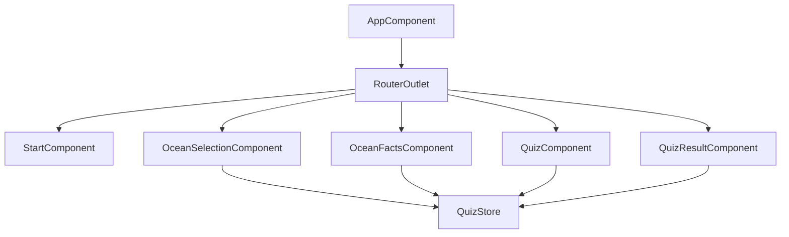

# Earth Ocean Learning - Documentation

## 1. Projektübersicht (Project Overview)

**Earth Ocean Learning** ist eine interaktive Webanwendung für Kinder (7-9 Jahre), die spielerisch Wissen über die Ozeane und ihre Bewohner vermittelt. Die Anwendung kombiniert einen Lernbereich mit einem Quiz-Modus, um das Gelernte zu festigen.

### Hauptfunktionen
*   **Interaktive Ozean-Karte**: Auswahl der 5 Weltmeere.
*   **Lernmodus**: Fakten und Bewohner zu jedem Ozean entdecken.
*   **Quiz-Modus**: Fragen beantworten und Sterne sammeln.
*   **Master Quiz Modus**: Ein freischaltbares Zeit-Quiz über alle Ozeane (nach Sammeln aller 5 Sterne).
*   **Fortschrittssystem**: Speicherung des Lernfortschritts (Sterne).
*   **Responsive Design**: Optimiert für Desktop und Tablet.

---

## 2. Technologiestack (Tech Stack)

*   **Framework**: Angular 21 (Standalone Components)
*   **State Management**: NgRx SignalStore
*   **Styling**: Tailwind CSS v4
*   **Build Tool**: Angular CLI
*   **Sprache**: TypeScript
*   **Daten**: JSON (lokal)

---

## 3. Architektur (Architecture)

Die Anwendung folgt dem **MVVM (Model-View-ViewModel)** Muster, angepasst für Angular mit SignalStore.

### Architektur-Diagramm

```mermaid
graph TD
    User[User] --> View[View (Components)]
    View --> ViewModel[ViewModel (SignalStore)]
    ViewModel --> Model[Model (Interfaces)]
    ViewModel --> Service[DataService]
    Service --> Data[JSON Data]
    
    subgraph "View Layer"
        StartComponent
        OceanSelectionComponent
        OceanFactsComponent
        QuizComponent
        QuizResultComponent
    end

    subgraph "State Management"
        QuizStore
    end

    subgraph "Data Layer"
        DataService
        OceanModel
    end
```

### Komponentendiagramm



---

## 4. Projektstruktur (Project Structure)

```
src/
├── app/
│   ├── features/           # Feature-Module (Standalone Components)
│   │   ├── ocean-facts/    # Fakten-Anzeige & Karussell
│   │   ├── ocean-selection/# Auswahl der Ozeane & Master Quiz Button
│   │   ├── quiz/           # Quiz-Logik & UI
│   │   ├── quiz-result/    # Ergebnisanzeige & Zertifikat
│   │   └── start/          # Startbildschirm
│   ├── models/             # TypeScript Interfaces (Ocean, QuizQuestion)
│   ├── services/           # DataService (JSON Fetching)
│   ├── store/              # QuizStore (State Management)
│   ├── app.routes.ts       # Routing Konfiguration
│   └── app.config.ts       # App Konfiguration
├── assets/
│   ├── data/               # ocean-data.json (Inhalte)
│   └── images/             # Bilder für Ozeane & Tiere
└── styles.css              # Globale Styles & Tailwind Imports
```

---

## 5. Installation & Setup

### Voraussetzungen
*   Node.js (v18 oder höher)
*   npm

### Installation
```bash
git clone <repository-url>
cd EOL
npm install
```

### Starten (Development)
```bash
npm start
```
Die Anwendung ist unter `http://localhost:4200` erreichbar.

---

## 6. Test Cases

| ID | Test Case | Vorbedingung | Schritte | Erwartetes Ergebnis |
|----|-----------|--------------|----------|-------------------|
| TC01 | App Start | - | URL öffnen | Startbildschirm mit "Los geht's" Button erscheint. |
| TC02 | Ozean Auswahl | Startbildschirm | Klick "Los geht's" | Ozean-Auswahl mit 5 Karten erscheint. |
| TC03 | Fakten Ansehen | Ozean-Auswahl | Klick auf Ozean | Fakten-Seite des Ozeans öffnet sich. |
| TC04 | Quiz Starten | Fakten-Seite | Klick "Quiz Starten" | Quiz beginnt mit erster Frage. |
| TC05 | Frage Beantworten (Richtig) | Quiz | Richtige Antwort wählen | Option wird grün, Feedback erscheint. |
| TC06 | Frage Beantworten (Falsch) | Quiz | Falsche Antwort wählen | Option rot, richtige grün, Feedback erscheint. |
| TC07 | Quiz Beenden | Quiz | Letzte Frage beantworten | Ergebnis-Seite zeigt Score & Stern (bei 100%). |
| TC08 | Master Quiz Unlock | 5 Sterne gesammelt | Ozean-Auswahl öffnen | "Master Quiz" Button ist aktiv (lila). |
| TC09 | Master Quiz Timer | Master Quiz | Quiz starten | 5-Sekunden Timer läuft pro Frage. |

---

## 7. Benutzerhandbuch (User Manual)

### 1. Starten
Öffnen Sie die App im Browser. Klicken Sie auf **"Los geht's"**, um Ihre Reise zu beginnen.

### 2. Ozean Auswählen
Wählen Sie einen der 5 Ozeane aus. Jeder Ozean hat seine eigene Farbe und Themenwelt.
*   **Gesperrtes Master Quiz**: Unten sehen Sie das "Ultimative Quiz". Dieses schaltet sich erst frei, wenn Sie in allen 5 Ozeanen einen Stern gesammelt haben.

### 3. Lernen & Entdecken
Auf der Ozean-Seite lernen Sie spannende Fakten und lernen die Bewohner kennen. Nutzen Sie die Pfeile, um durch die Informationen zu blättern.

### 4. Quiz Spielen
Testen Sie Ihr Wissen!
*   Beantworten Sie alle Fragen richtig, um einen **Stern** zu erhalten.
*   Haben Sie einen Fehler gemacht? Kein Problem, versuchen Sie es einfach noch einmal!

### 5. Master Quiz (Experten-Modus)
Sobald Sie alle 5 Sterne haben:
*   Klicken Sie auf der Auswahlseite auf **"Ultimatives Quiz Starten"**.
*   **Achtung**: Hier läuft die Zeit! Sie haben nur 5 Sekunden pro Frage.
*   Fragen kommen gemischt aus allen Ozeanen.
*   Am Ende winkt eine spezielle **Urkunde**!

---

## 8. Zukünftige Verbesserungen (Roadmap)

*   [ ] Sound-Effekte & Hintergrundmusik
*   [ ] Mehrsprachigkeit (i18n)
*   [ ] PWA Support (Offline-Fähigkeit)
*   [ ] 3D-Elemente für Ozean-Karten
