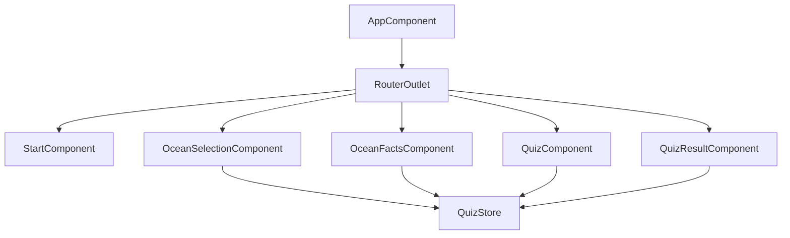
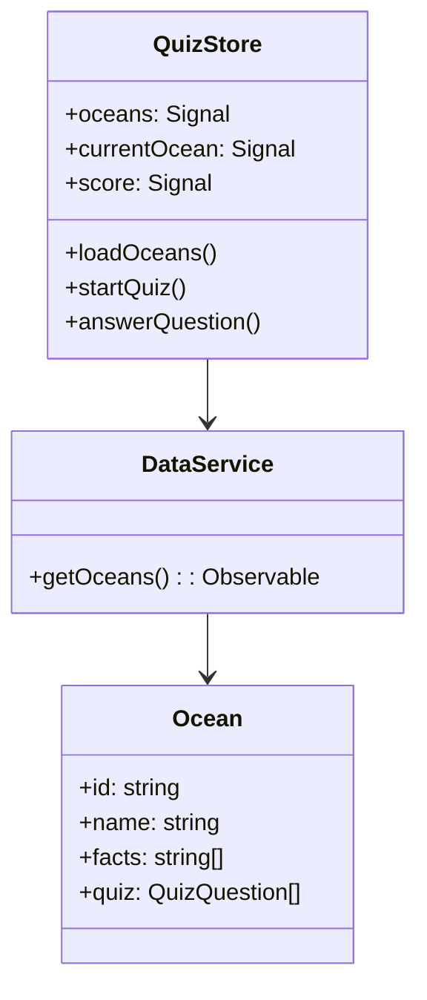
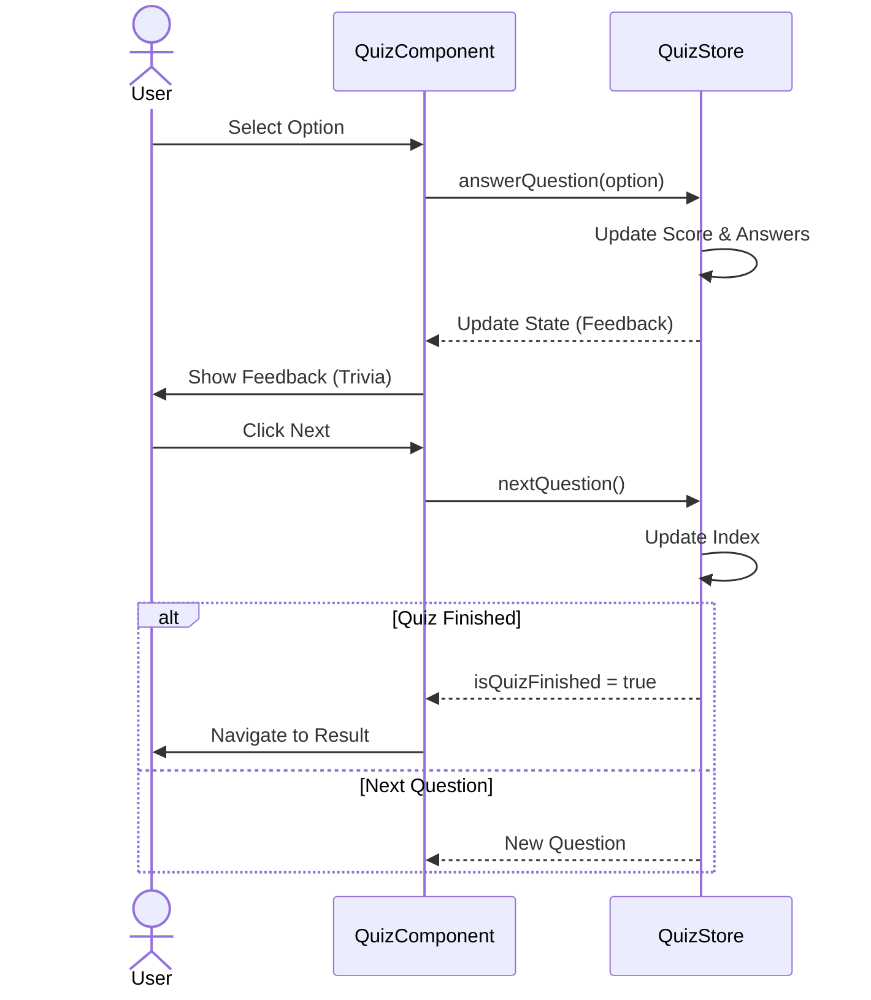

# Earth Ocean Learning - Documentation

## 1. Architekturentwurf (Architecture Design)

The application follows the **MVVM (Model-View-ViewModel)** architecture pattern, adapted for Angular with SignalStore.

### Architecture Diagram (Mermaid)

```mermaid
graph TD
    User[User] --> View["View (Components)"]
    View --> ViewModel["ViewModel (SignalStore)"]
    ViewModel --> Model[Model (Interfaces)]
    ViewModel --> Service[DataService]
    Service --> Data[JSON Data]
    
    subgraph "View Layer"
        StartComponent
        OceanSelectionComponent
        OceanFactsComponent
        QuizComponent
        QuizResultComponent
    end

    subgraph "State Management"
        QuizStore
    end

    subgraph "Data Layer"
        DataService
        OceanModel
    end
```

## 2. Komponentendiagramm (Component Diagram)



## 3. Klassendiagramm (Class Diagram)



## 4. Sequenzdiagramm (Sequence Diagram: Quiz Flow)



## 5. Test Cases

| ID | Test Case | Preconditions | Steps | Expected Result |
|----|-----------|---------------|-------|-----------------|
| TC01 | Start App | App loaded | Open URL | Start screen appears with "Los geht's" button |
| TC02 | Select Ocean | Start screen | Click "Los geht's", Click Ocean Card | Navigate to Facts, show correct ocean info |
| TC03 | Start Quiz | Facts screen | Click "Quiz Starten" | Navigate to Quiz, show first question |
| TC04 | Answer Correct | Quiz screen | Click correct option | Option turns green, trivia appears |
| TC05 | Answer Wrong | Quiz screen | Click wrong option | Option turns red, correct turns green, trivia appears |
| TC06 | Finish Quiz | Quiz screen | Answer last question, Click Next | Navigate to Result, show score |
| TC07 | Perfect Score | Quiz screen | Answer all correctly | Result screen shows confetti and "Fantastisch" |

## 6. Testprotokolle (Test Protocols)

*To be filled during manual testing.*

| Date | Tester | Test Case | Status | Notes |
|------|--------|-----------|--------|-------|
| 2025-11-20 | Dev | TC01 | Pass | - |
| 2025-11-20 | Dev | TC02 | Pass | - |
| 2025-11-20 | Dev | TC03 | Pass | - |

## 7. Benutzerhandbuch (User Manual)

### Starten der Anwendung
Öffnen Sie die Anwendung in einem modernen Webbrowser. Sie werden vom Startbildschirm begrüßt.

### Ozean Auswählen
Klicken Sie auf "Los geht's", um zur Ozean-Auswahl zu gelangen. Hier sehen Sie 5 Karten für die verschiedenen Ozeane. Klicken Sie auf eine Karte, um mehr zu erfahren.

### Lernen
Im Lern-Bereich können Sie durch Fakten und Bewohner des Ozeans blättern. Nutzen Sie die Pfeiltasten oder die Schaltflächen auf dem Bildschirm.

### Quiz Spielen
Wenn Sie bereit sind, klicken Sie auf "Quiz Starten". Beantworten Sie die Fragen durch Klicken auf die Antwortmöglichkeiten.
- **Grün**: Richtig!
- **Rot**: Leider falsch.

Am Ende sehen Sie Ihr Ergebnis. Viel Erfolg!
