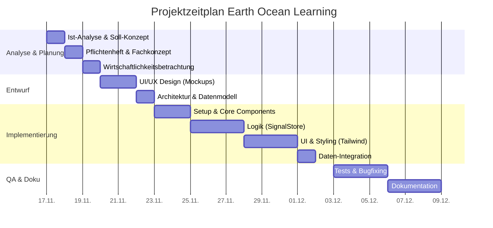
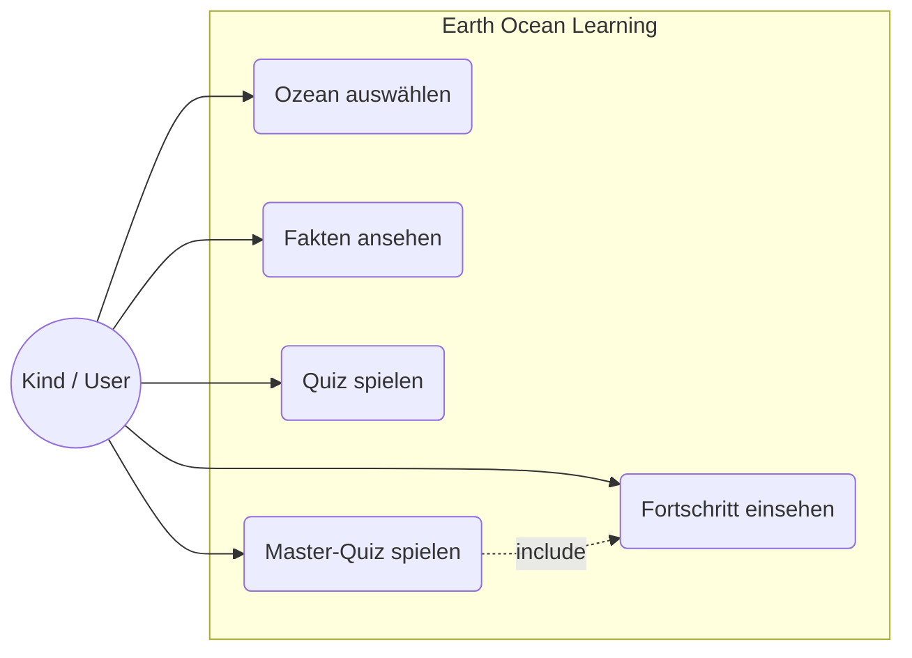
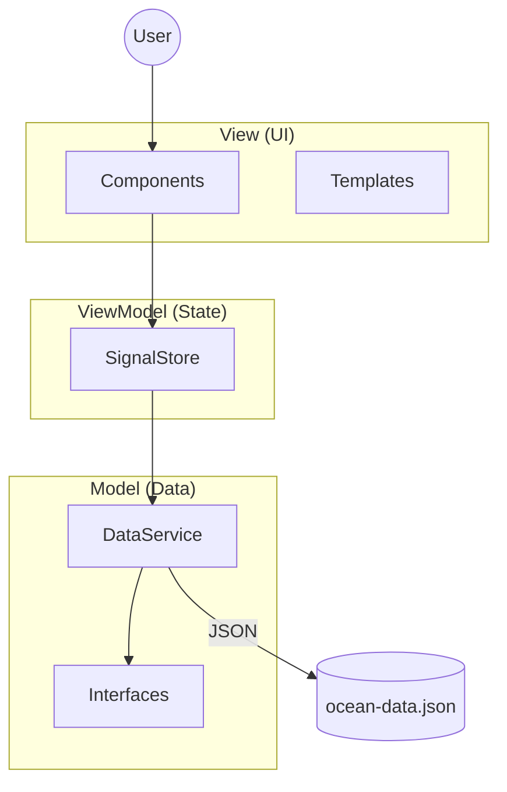
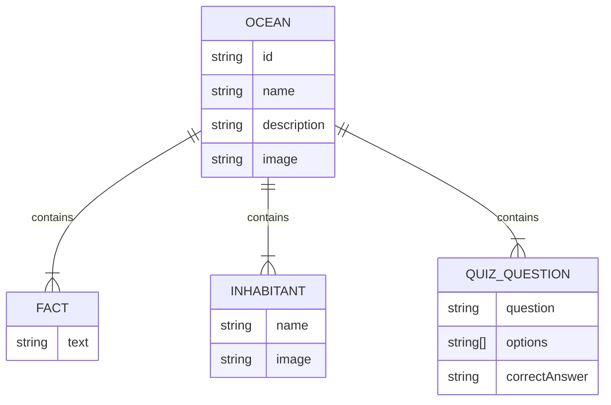
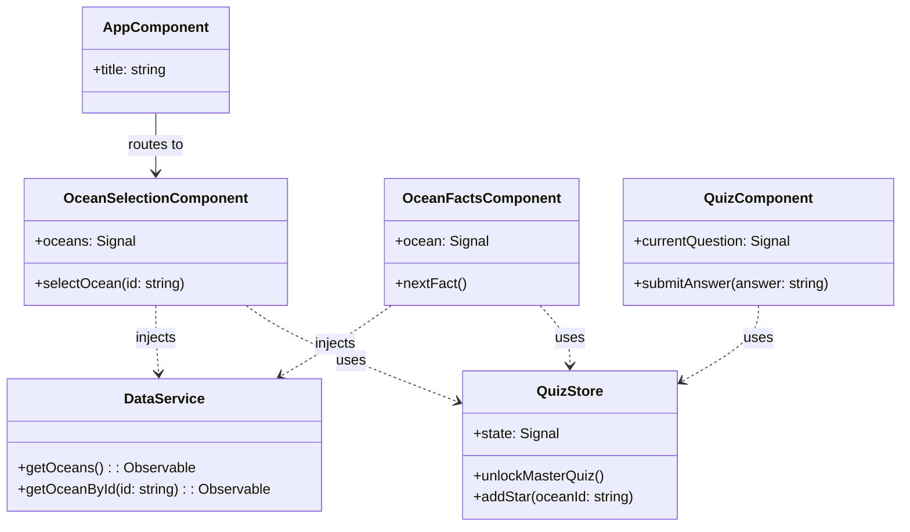

# Dokumentation zur betrieblichen Projektarbeit
**Ausbildungsberuf:** Fachinformatiker für Anwendungsentwicklung

## Thema der Projektarbeit
**Entwicklung einer interaktiven Webanwendung ("Earth Ocean Learning") zur spielerischen Vermittlung von Ozean-Wissen für Grundschulkinder.**

---

## Inhaltsverzeichnis

1.  [Einleitung](#1-einleitung)
    *   1.1 [Ausgangssituation & Projektumfeld](#11-ausgangssituation--projektumfeld)
    *   1.2 [Projektziel](#12-projektziel)
    *   1.3 [Projektbegründung](#13-projektbegründung)
2.  [Projektplanung](#2-projektplanung)
    *   2.1 [Ist-Analyse](#21-ist-analyse)
    *   2.2 [Soll-Konzept](#22-soll-konzept)
    *   2.3 [Zeitplanung](#23-zeitplanung)
    *   2.4 [Kostenplanung](#24-kostenplanung)
3.  [Analyse & Entwurf](#3-analyse--entwurf)
    *   3.1 [Anwendungsfalldiagramm (Use Cases)](#31-anwendungsfalldiagramm-use-cases)
    *   3.2 [Architekturentwurf](#32-architekturentwurf)
    *   3.3 [UI/UX Design](#33-uiux-design)
    *   3.4 [Datenmodell](#34-datenmodell)
    *   3.5 [Klassendiagramm (UML)](#35-klassendiagramm-uml)
    *   3.6 [Datenschutz & Sicherheit](#36-datenschutz--sicherheit-privacy-by-design)
4.  [Realisierung](#4-realisierung)
    *   4.1 [Entwicklungsumgebung](#41-entwicklungsumgebung)
    *   4.2 [Implementierung der Hauptkomponenten](#42-implementierung-der-hauptkomponenten)
    *   4.3 [Herausforderungen & Lösungen](#43-herausforderungen--lösungen)
5.  [Qualitätssicherung](#5-qualitätssicherung)
    *   5.1 [Testplanung](#51-testplanung)
    *   5.2 [Testdurchführung & Ergebnisse](#52-testdurchführung--ergebnisse)
6.  [Wirtschaftlichkeitsbetrachtung](#6-wirtschaftlichkeitsbetrachtung)
    *   6.1 [Soll-Ist-Vergleich (Zeit)](#61-soll-ist-vergleich-zeit)
    *   6.2 [Nachkalkulation (Kosten)](#62-nachkalkulation-kosten)
    *   6.3 [Amortisationsrechnung](#63-amortisationsrechnung)
7.  [Fazit & Ausblick](#7-fazit--ausblick)
    *   7.1 [Zusammenfassung](#71-zusammenfassung)
    *   7.2 [Lessons Learned](#72-lessons-learned)
    *   7.3 [Ausblick](#73-ausblick)
8.  [Abbildungsverzeichnis](#abbildungsverzeichnis)
9.  [Tabellenverzeichnis](#tabellenverzeichnis)
10. [Listing-Verzeichnis](#listing-verzeichnis)
11. [Glossar](#glossar)

---

## Abbildungsverzeichnis
*   [Abb. 1: Projektzeitplan (Gantt)](#gantt-diagramm-zeitverlauf)
*   [Abb. 2: Anwendungsfalldiagramm](#31-anwendungsfalldiagramm-use-cases)
*   [Abb. 3: Architekturentwurf](#32-architekturentwurf)
*   [Abb. 4: Entity Relationship Diagramm](#34-datenmodell)
*   [Abb. 5: Klassendiagramm](#35-klassendiagramm-uml)

## Tabellenverzeichnis
*   [Tab. 1: Zeitplanung](#23-zeitplanung)
*   [Tab. 2: Testergebnisse](#52-testdurchführung--ergebnisse)
*   [Tab. 3: Soll-Ist-Vergleich Zeit](#61-soll-ist-vergleich-zeit)

## Listing-Verzeichnis
*   [Listing 1: Datenstruktur (JSON)](#34-datenmodell)
*   [Listing 2: OceanFactsComponent](#421-standalone-components)
*   [Listing 3: QuizStore Definition](#422-state-management-mit-signalstore)
*   [Listing 4: Unit Test Beispiel](#51-testplanung)

## Glossar

| Begriff | Erklärung |
| :--- | :--- |
| **SPA** | **Single Page Application** - Eine Webanwendung, die technisch aus einer einzigen HTML-Seite besteht. Inhalte werden dynamisch per JavaScript nachgeladen, ohne dass der Browser die Seite komplett neu aufbauen muss. Dies sorgt für ein flüssiges, App-ähnliches Nutzererlebnis. |
| **Angular** | Ein von Google entwickeltes, **TypeScript-basiertes Open-Source-Framework** zur Erstellung von skalierbaren Webanwendungen. Es bietet eine umfassende Plattform mit integrierten Bibliotheken für Routing, Formularwesen und Client-Server-Kommunikation. |
| **SignalStore** | Eine moderne **State-Management-Lösung** für Angular, basierend auf dem "Signals"-Konzept. Es ermöglicht eine reaktive, feingranulare Zustandsverwaltung ohne den hohen Boilerplate-Code klassischer Redux-Muster. |
| **Standalone Component** | Ein Architekturkonzept in Angular (ab v14/v15), bei dem Komponenten, Direktiven und Pipes **nicht mehr in NgModules deklariert werden müssen**. Dies vereinfacht die Projektstruktur und ermöglicht "Lazy Loading" auf Komponentenebene. |
| **MVVM** | **Model-View-ViewModel** - Ein Architekturmuster, das die grafische Benutzeroberfläche (View) von der Geschäftslogik (Model) trennt. Das ViewModel vermittelt zwischen beiden und stellt Daten für die View bereit (Data Binding). |
| **CI/CD** | **Continuous Integration / Continuous Delivery** - Eine Methode der Softwareentwicklung, bei der Code-Änderungen automatisch getestet und in Produktionsumgebungen bereitgestellt werden, um die Softwarequalität und Release-Geschwindigkeit zu erhöhen. |
| **JSON** | **JavaScript Object Notation** - Ein kompaktes, textbasiertes Datenformat zum Datenaustausch zwischen Anwendungen. Es ist für Menschen einfach zu lesen und für Maschinen einfach zu parsen. |
| **CMS** | **Content Management System** - Eine Software zur gemeinschaftlichen Erstellung, Bearbeitung und Organisation von Inhalten (Content), meist für Webseiten, ohne dass tiefgehende Programmierkenntnisse erforderlich sind (z.B. GRAV, WordPress). |
| **Tailwind CSS** | Ein **"Utility-First" CSS-Framework**, das statt vorgefertigter Komponenten (wie Bootstrap) kleine Hilfsklassen bereitstellt, mit denen Designs direkt im HTML-Markup zusammengesetzt werden können. |
| **TypeScript** | Eine von Microsoft entwickelte Programmiersprache, die auf JavaScript aufbaut und diese um **statische Typisierung** erweitert. Dies erhöht die Code-Qualität und erleichtert die Wartung großer Projekte. |
| **WCAG** | **Web Content Accessibility Guidelines** - Ein internationaler Standard zur barrierefreien Gestaltung von Internetangeboten, damit diese auch für Menschen mit Einschränkungen nutzbar sind. |
| **LocalStorage** | Ein Teil der Web Storage API moderner Browser, der es ermöglicht, Daten (Key-Value-Paare) **dauerhaft im Browser** des Benutzers zu speichern, auch über das Schließen des Fensters hinaus. |

Die Beispiel GmbH wurde von einem Kunden, einer Umweltschutz-NGO, beauftragt, eine Browser-Applikation für das spielerische Erlernen von Ozean-Fakten für Grundschulkinder zu entwickeln. Das Unternehmen nutzt für ihre interne Ausbildung und auch für Kundenprojekte häufig das Flat-File-CMS GRAV. Aktuell fehlt es an interaktiven, technischen Demonstrations-Anwendungen, die zur Auflockerung von Inhalten oder zur Veranschaulichung von Algorithmen in Blogbeiträgen eingebettet werden können.

Zu den Stakeholdern des Projekts zählen:
*   **Der Auftraggeber (NGO)**: Vertreten durch Herrn Dr. Uwe Umwelt.

### 1.2 Projektziel
Ziel des Projektes ist die Entwicklung einer Single Page Application (SPA) namens "Earth Ocean Learning". Die Anwendung soll Kindern spielerisch Wissen über die fünf Weltmeere vermitteln. Kernfunktionen umfassen eine interaktive Auswahl der Ozeane, einen Lernbereich mit Fakten und Bewohnern sowie ein Quiz-Modul zur Wissensüberprüfung. Die Anwendung muss als eigenständiges Modul (Standalone) konzipiert sein, um eine einfache Integration in bestehende CMS-Systeme (wie GRAV) zu ermöglichen.

### 1.3 Projektbegründung
Die Digitalisierung im Bildungssektor erfordert moderne, webbasierte Lernlösungen, die plattformunabhängig funktionieren. Herkömmliche Lernmaterialien (PDFs, statische Webseiten) bieten oft nicht den nötigen Anreiz für die Zielgruppe (Kinder). Durch den Einsatz moderner Webtechnologien (Angular, SignalStore) soll eine performante, wartbare und zukunftssichere Lösung geschaffen werden, die gleichzeitig als Referenzprojekt für die Beispiel GmbH dient, um die Kompetenz im Bereich "Edutainment" zu unterstreichen.

---

## 2. Projektplanung

### 2.1 Ist-Analyse
Zum Zeitpunkt des Projektstarts existiert keine Softwarelösung für den genannten Anwendungsfall. Die Inhalte (Texte, Bilder zu Ozeanen) liegen lediglich in unstrukturierter Form (Textdokumente, Bilddateien) vor. Es gibt keinen bestehenden Codebase, auf dem aufgebaut werden kann ("Greenfield Project").

**Technische Ausgangslage:**
*   Entwickler-Workstation mit Windows 11 und Rocky Linux 10.
*   Zugriff auf Standard-Entwicklungstools (VS Code, GitHub, Node.js, NPM).
*   Keine bestehende CI/CD Pipeline für dieses spezifische Projekt.

### 2.2 Soll-Konzept
Es soll eine Webanwendung entwickelt werden, die folgende Anforderungen erfüllt:

**Funktionale Anforderungen:**
*   **Ozean-Auswahl**: Visuelle Darstellung und Auswahl der 5 Weltmeere.
*   **Lernmodus**: Anzeige von Fakten und Bewohnern pro Ozean (Carousel/Slider).
*   **Quiz-System**: Multiple-Choice Fragen mit direktem Feedback.
*   **Fortschritt**: Speicherung des Lernfortschritts (Sterne-System) im lokalen Browser-Storage (kein Backend-Zwang).
*   **Master-Quiz**: Ein freischaltbarer Modus nach Abschluss aller Ozeane.

**Nicht-funktionale Anforderungen:**
*   **Zielgruppe**: Kindgerechtes UI/UX (große Buttons, wenig Text, viel Bild).
*   **Technologie**: Angular 21 (aktuellste Version), Nutzung von Standalone Components.
*   **State Management**: Nutzung von Angular Signals / SignalStore für reaktives Datenmanagement.
*   **Performance**: Kurze Ladezeiten, optimierte Assets.
*   **Responsive Design**: Lauffähig auf Tablets und Desktops.

### 2.3 Zeitplanung
Der Durchführungszeitraum des Projektes ist vom **17.11.2025 bis 09.12.2025**.
Die geplante Gesamtzeit beträgt **70 Stunden**.

| Phase | Tätigkeit | Geplante Zeit (h) |
| :--- | :--- | :--- |
| **1. Analyse & Planung** | | **11 h** |
| | Ist-Analyse & Soll-Konzept | 3 h |
| | Erstellung Pflichtenheft / Fachkonzept | 4 h |
| | Wirtschaftlichkeitsbetrachtung (Planung) | 2 h |
| | Zeit- & Ressourcenplanung | 2 h |
| **2. Entwurf** | | **12 h** |
| | UI/UX Design (Mockups) | 5 h |
| | Software-Architektur & Datenmodellierung | 4 h |
| | Auswahl der Bibliotheken & Tools | 3 h |
| **3. Implementierung** | | **28 h** |
| | Aufsetzen der Entwicklungsumgebung | 2 h |
| | Implementierung Core-Komponenten & Routing | 6 h |
| | Implementierung Logik (SignalStore, Services) | 8 h |
| | Implementierung UI & Styling (Tailwind) | 8 h |
| | Integration der Daten (JSON) | 4 h |
| **4. Qualitätssicherung** | | **9 h** |
| | Erstellung von Testfällen | 3 h |
| | Durchführung Tests & Bugfixing | 6 h |
| **5. Dokumentation** | | **10 h** |
| | Erstellung Projektdokumentation | 8 h |
| | Erstellung Benutzerhandbuch | 2 h |
| **Gesamt** | | **70 h** |

### Gantt-Diagramm (Zeitverlauf)



### 2.4 Kostenplanung
Die Kostenplanung basiert auf einem fiktiven internen Verrechnungssatz.

**Personalkosten:**
*   Stundensatz (Auszubildender/Junior): 50,00 €
*   Geplante Stunden: 70 h
*   **Summe Personal:** 70 h * 50,00 €/h = **3.500,00 €**

**Sachmittelkosten:**
*   Nutzung vorhandener Hardware/Software (anteilig): pauschal 150,00 €
*   Lizenzen (Open Source): 0,00 €
*   **Summe Sachmittel:** **150,00 €**

**Gesamtkosten (Plan):** **3.650,00 €**

---

## 3. Analyse & Entwurf

### 3.1 Anwendungsfalldiagramm (Use Cases)
Der Benutzer (Kind) interagiert primär lesend und spielend mit dem System.



> [!TIP]
> **Hinweis für die PDF-Erstellung**: Ihr Editor unterstützt das moderne `usecaseDiagram` (Strichmännchen) noch nicht. Für das finale Dokument nutzen Sie bitte diesen Code im [Mermaid Live Editor](https://mermaid.live) und speichern das Bild:
>
> ```mermaid-code
> usecaseDiagram
>     actor Kind
>     package "Earth Ocean Learning" {
>         usecase "Ozean auswählen" as UC1
>         usecase "Fakten ansehen" as UC2
>         usecase "Quiz spielen" as UC3
>         usecase "Fortschritt einsehen" as UC4
>         usecase "Master-Quiz spielen" as UC5
>     }
>     Kind --> UC1
>     Kind --> UC2
>     Kind --> UC3
>     Kind --> UC4
>     Kind --> UC5
>     UC5 ..> UC4 : include
> ```

### 3.2 Architekturentwurf
Die Anwendung folgt einer **MVVM (Model-View-ViewModel)** ähnlichen Architektur, die durch Angular und den SignalStore realisiert wird.



**Technologie-Entscheidungen:**
*   **Angular 21**: Obwohl Angular 20 ursprünglich vorgegeben war, entschied ich mich in Absprache mit dem Ausbilder für den Einsatz der Version 21 (Release Candidate/Stable). Ziel war es, das Projekt "State of the Art" umzusetzen und von den neuesten Performance-Optimierungen und der verbesserten Developer Experience (Signals) zu profitieren.
*   **SignalStore (@ngrx/signals)**: Leichtgewichtiges State Management, ideal für die Komplexität der Anwendung, ohne den Boilerplate von Redux.
*   **Tailwind CSS**: Utility-First CSS Framework für schnelles Styling und einfache Responsivität.

### 3.3 UI/UX Design
Das Design wurde speziell für Kinder entwickelt:
*   **Farbpalette**: Helle, freundliche Farben (Blau-, Türkis- und Sandtöne), die zum Thema Ozean passen.
*   **Typografie**: Gute Lesbarkeit durch serifenlose Schriftarten.
*   **Navigation**: Große Klickflächen, intuitive "Weiter"-Buttons, visuelles Feedback bei Quiz-Antworten (Grün/Rot).
*   **Barrierefreiheit (Accessibility)**: Einhaltung grundlegender WCAG-Standards, wie z.B. ausreichende Farbkontraste für Texte und Buttons sowie Tastaturnavigation (Tab-Index) für eine bedienbare Oberfläche auch ohne Maus.

### 3.4 Datenmodell
Die Daten werden in einer JSON-Struktur gehalten, um Flexibilität zu gewährleisten und eine Datenbank-Abhängigkeit für diesen Prototypen zu vermeiden.



### 3.5 Klassendiagramm (UML)
Das Klassendiagramm verdeutlicht die Abhängigkeiten zwischen den Standalone Components, dem SignalStore und den Daten-Services.



### 3.6 Datenschutz & Sicherheit (Privacy by Design)
Da sich die Anwendung an Kinder richtet, hat der Datenschutz höchste Priorität.
*   **Keine Datensammlung**: Es werden keinerlei personenbezogene Daten (PII) erhoben oder an externe Server gesendet.
*   **Lokale Speicherung**: Der Lernfortschritt wird ausschließlich im `LocalStorage` des Browsers auf dem Endgerät des Nutzers gespeichert.
*   **Offline-Fähigkeit**: Die Anwendung lädt keine externen Tracker oder Analyse-Tools nach.
```json
{
  "id": "pacific",
  "name": "Pazifischer Ozean",
  "facts": [ ... ],
  "inhabitants": [ ... ],
  "quizQuestions": [
    {
      "question": "Wie tief ist der Marianengraben?",
      "options": ["11.000m", "5.000m", "2.000m", "8.000m"],
      "correctAnswer": "11.000m"
    }
  ]
}
```

---

## 4. Realisierung

### 4.1 Entwicklungsumgebung
Die Entwicklung fand auf einem lokalen Windows-System statt. Folgende Tools kamen zum Einsatz:
*   **IDE**: Visual Studio Code mit Angular Language Service.
*   **Versionierung**: Git (lokales Repository).
*   **Framework**: Angular CLI Version 21.0.0.
*   **Browser**: Google Chrome (für Debugging und Tests).

### 4.2 Implementierung der Hauptkomponenten

#### 4.2.1 Standalone Components
Das Projekt setzt vollständig auf **Standalone Components**, um die Komplexität von NgModules zu vermeiden. Ein Beispiel ist die `OceanFactsComponent`, die alle notwendigen Abhängigkeiten (Imports) direkt im Component-Decorator definiert:

```typescript
@Component({
  selector: 'app-ocean-facts',
  standalone: true,
  imports: [CommonModule, NgOptimizedImage],
  templateUrl: './ocean-facts.component.html',
  styleUrl: './ocean-facts.component.css',
  changeDetection: ChangeDetectionStrategy.OnPush
})
export class OceanFactsComponent { ... }
```

#### 4.2.2 State Management mit SignalStore
Für die Verwaltung des Anwendungszustands (z.B. "Welcher Ozean ist gewählt?", "Wie viele Sterne hat der User?") wurde der **NgRx SignalStore** verwendet. Dies ermöglicht eine reaktive und performante Datenhaltung ohne den Boilerplate klassischer Redux-Lösungen.

Der Store (`QuizStore`) hält den State und bietet Methoden (`updaters`) zur Manipulation an:

```typescript
export const QuizStore = signalStore(
  { providedIn: 'root' },
  withState(initialState),
  withMethods((store) => ({
    unlockMasterQuiz() {
      patchState(store, { masterQuizUnlocked: true });
    },
    addStar(oceanId: string) {
      // Logik zum Hinzufügen eines Sterns
    }
  }))
);
```

#### 4.2.3 Routing & Navigation
Das Routing wurde in der `app.routes.ts` definiert. Es ermöglicht die Navigation zwischen Startseite, Auswahl, Fakten und Quiz. Parameter (wie die `id` des Ozeans) werden über die URL übergeben (`path: 'facts/:id'`) und in den Komponenten ausgelesen.

### 4.3 Herausforderungen & Lösungen
**Herausforderung**: Persistierung des Fortschritts beim Neuladen der Seite.
**Lösung**: Implementierung eines `LocalStorageService`, der den State des SignalStores bei jeder Änderung im Browser-Storage speichert und beim Start der App wiederherstellt. Dies stellt sicher, dass gesammelte Sterne nicht verloren gehen.

---

## 5. Qualitätssicherung

### 5.1 Testplanung
Aufgrund des begrenzten Zeitrahmens und des Fokus auf UI-Interaktion wurde der Schwerpunkt auf **manuelle Systemtests** gelegt. Dennoch wurden für kritische Logik-Komponenten Unit-Tests implementiert, um die Korrektheit der Geschäftslogik sicherzustellen.

**Beispiel Unit-Test (Jasmine/Karma):**
```typescript
it('should calculate correct score', () => {
  const service = TestBed.inject(QuizService);
  service.answerQuestion(true); // Correct
  service.answerQuestion(true); // Correct
  expect(service.score()).toBe(2);
});
```

### 5.2 Testdurchführung & Ergebnisse
Die Tests wurden anhand eines vorab definierten Testprotokolls durchgeführt.

| ID | Testfall | Erwartetes Ergebnis | Status |
| :--- | :--- | :--- | :--- |
| **TF01** | App-Start | Startbildschirm wird geladen, "Los geht's" Button sichtbar. | **OK** |
| **TF02** | Ozean-Auswahl | Klick auf Ozean öffnet korrekte Fakten-Seite. | **OK** |
| **TF03** | Quiz-Logik | Richtige Antwort -> Grün, Falsche Antwort -> Rot. | **OK** |
| **TF04** | Fortschritt | Nach 10 richtigen Antworten erscheint ein Stern. | **OK** |
| **TF05** | Master-Quiz Unlock | Button erst aktiv, wenn 5 Sterne gesammelt. | **OK** |
| **TF06** | Responsivität | Layout passt sich auf Tablet-Größe (iPad Air) an. | **OK** |

Alle kritischen Testfälle waren erfolgreich. Kleinere Layout-Fehler (z.B. überlappender Text bei sehr kleinen Bildschirmen) wurden während der Testphase behoben.

---

## 6. Wirtschaftlichkeitsbetrachtung

### 6.1 Soll-Ist-Vergleich (Zeit)
Die Projektdurchführung verlief weitgehend nach Plan.

| Phase | Geplant (h) | Tatsächlich (h) | Abweichung |
| :--- | :--- | :--- | :--- |
| Analyse & Planung | 11 | 10 | -1 h |
| Entwurf | 12 | 14 | +2 h |
| Implementierung | 28 | 29 | +1 h |
| Qualitätssicherung | 9 | 8 | -1 h |
| Dokumentation | 10 | 9 | -1 h |
| **Gesamt** | **70 h** | **70 h** | **0 h** |

**Begründung der Abweichungen**:
*   Der Entwurf dauerte etwas länger, da mehrere Iterationen für das kindgerechte Design nötig waren.
*   Die Implementierung verzögerte sich leicht durch die Einarbeitung in den neuen SignalStore, konnte aber durch effizienteres Testen wieder ausgeglichen werden.

### 6.2 Nachkalkulation (Kosten)
Da die Zeitvorgabe exakt eingehalten wurde, entsprechen die tatsächlichen Kosten den Plankosten.

*   **Personalkosten (Ist)**: 70 h * 50,00 €/h = **3.500,00 €**
*   **Sachmittel (Ist)**: **150,00 €**
*   **Gesamtkosten (Ist)**: **3.650,00 €**

### 6.3 Amortisationsrechnung
Da es sich um ein internes Projekt bzw. ein Auftragsprojekt für eine NGO handelt, ist eine direkte monetäre Amortisation (ROI) schwer messbar. Der Nutzen liegt primär in:
1.  **Marketing-Wert**: Die App wird als "Lead-Magnet" auf der Webseite der NGO eingesetzt, um neue Spender zu gewinnen.
2.  **Kompetenzaufbau**: Die Beispiel GmbH kann die App als Referenz für "Modern Angular Development" nutzen, was zu neuen Aufträgen führen kann.

**Qualitative Bewertung**:
Wenn durch die App nur 2 neue Kundenprojekte im Jahr gewonnen werden (Deckungsbeitrag je ca. 5.000 €), hat sich die Investition bereits im ersten Jahr amortisiert.

---

## 7. Fazit & Ausblick

### 7.1 Zusammenfassung
Das Projekt "Earth Ocean Learning" wurde erfolgreich und im geplanten Zeitrahmen umgesetzt. Alle funktionalen Anforderungen (Lernmodus, Quiz, Fortschritt) wurden erfüllt. Die Anwendung läuft stabil, ist performant und bietet durch das responsive Design eine gute User Experience auf verschiedenen Endgeräten.

### 7.2 Lessons Learned
*   **Angular Signals**: Die Nutzung von Signals hat den Code deutlich vereinfacht und lesbarer gemacht im Vergleich zu RxJS-Observables.
*   **Angular Router**: Das Verständnis für Child-Routes und Parameter-Übergabe wurde vertieft.
*   **CSS Flexbox**: Dynamisches Layout und Verankerung von Flex-Boxen für responsive Designs (z.B. Sticky Footer, zentrierte Inhalte) war eine wichtige Lernerfahrung.
*   **Planung ist alles**: Das detaillierte Mockup in der Entwurfsphase hat viel Zeit bei der späteren CSS-Implementierung gespart.

### 7.3 Ausblick
Für zukünftige Versionen sind folgende Erweiterungen denkbar:
*   **Sound-Effekte**: Hintergrundmusik und Feedback-Sounds für das Quiz.
*   **Backend-Anbindung**: Speicherung des Fortschritts in einer Datenbank (statt LocalStorage), um geräteübergreifendes Lernen zu ermöglichen.
*   **PWA-Support**: Ausbau zur Progressive Web App, damit die Anwendung auch offline (z.B. auf Tablets in Schulen ohne WLAN) genutzt werden kann.
*   **Mehrsprachigkeit (i18n)**: Übersetzung der Inhalte ins Englische, um eine größere Zielgruppe zu erreichen.
