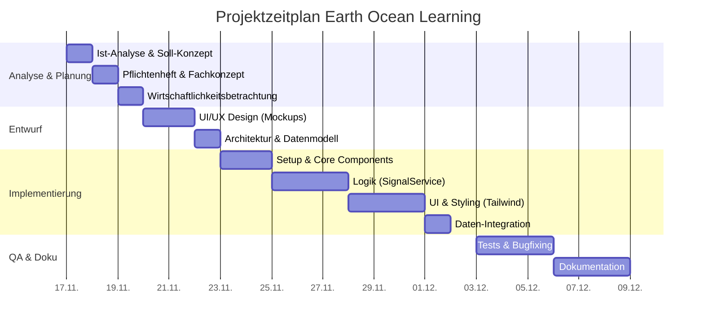
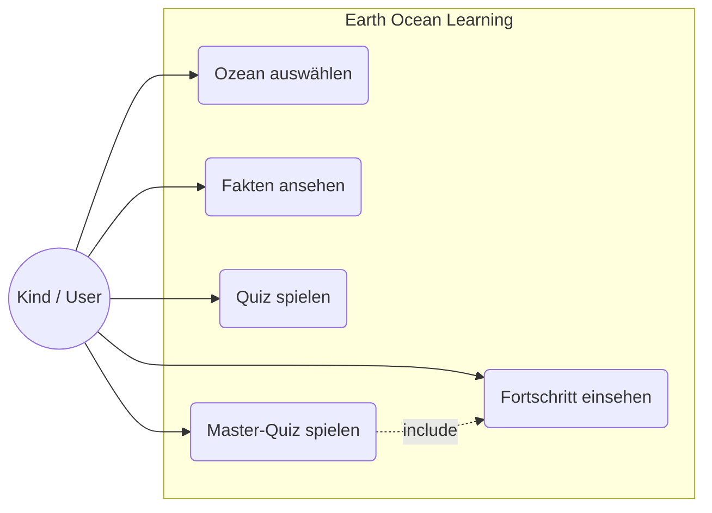
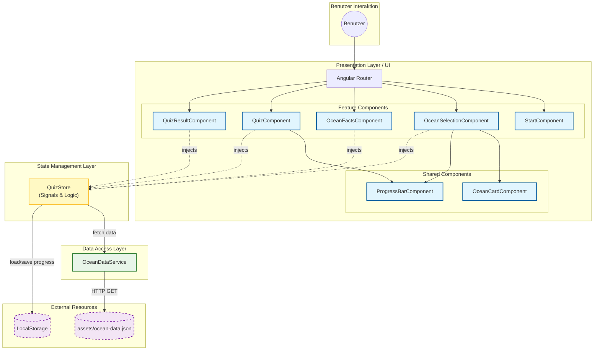
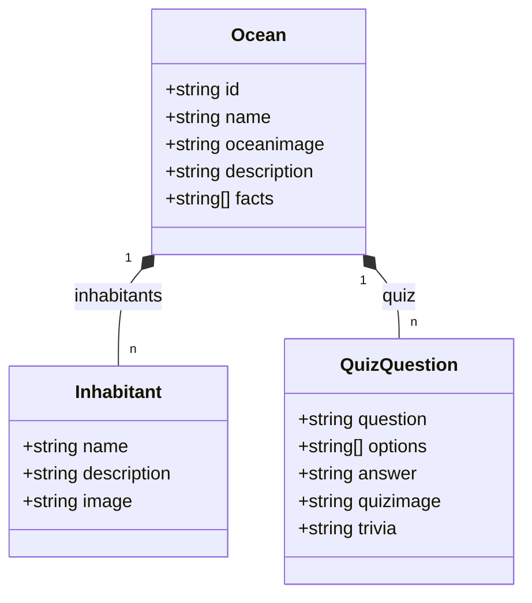
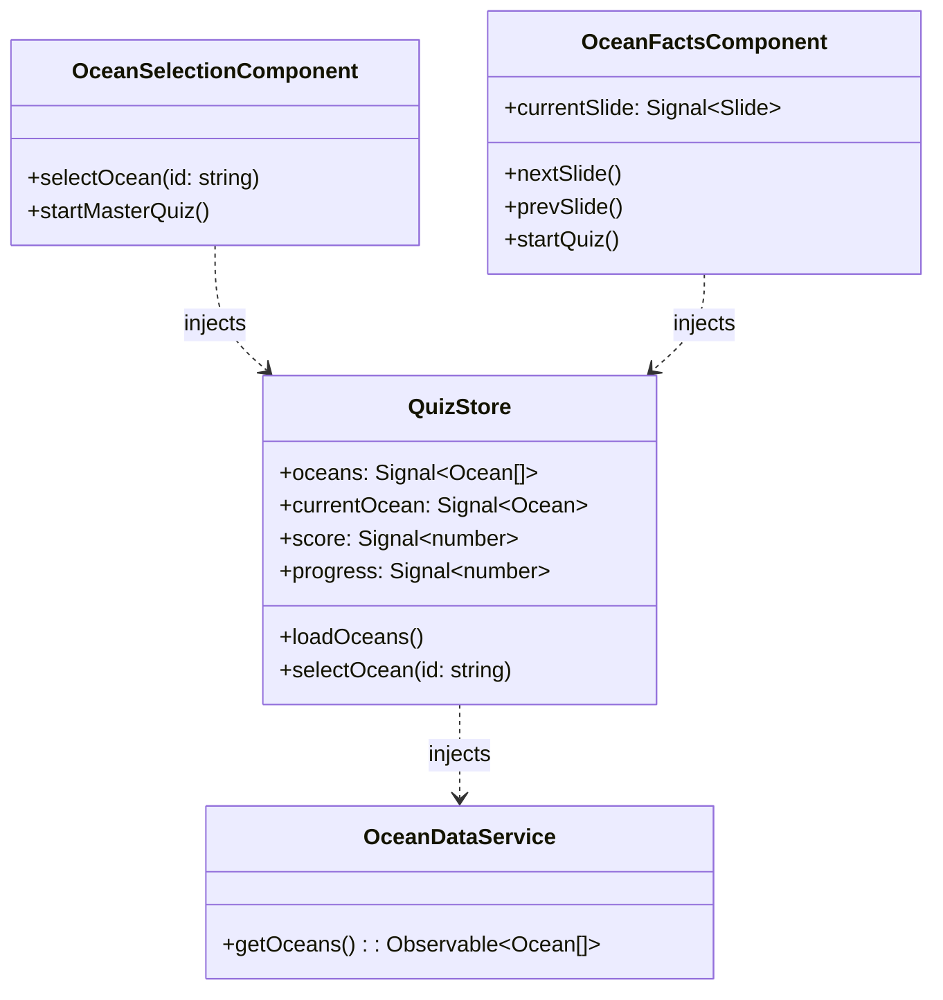

# EOL App - Dokumentation zur Kurs-Projektarbeit

**Thema:** Entwicklung einer kindgerechten Angular SPA zur Vermittlung von Wissen über die 5 Ozeane für Kinder (7-9 Jahre)

**Prüfling:**
Tobias Boyke
Musterstraße 1
40470 Düsseldorf
Prüfungsnummer: 0001278495

**Ausbildungsbetrieb:**
Beispiel GmbH
Firmenweg 2
41460 Neuss

**Abgabe der Dokumentation:** 09.12.2025

---

## Inhaltsverzeichnis

1. [Einleitung](#1-einleitung)
2. [Projektplanung](#2-projektplanung)
3. [Analyse & Entwurf](#3-analyse--entwurf)
4. [Realisierung](#4-realisierung)
5. [Qualitätssicherung](#5-qualitätssicherung)
6. [Wirtschaftlichkeitsbetrachtung](#6-wirtschaftlichkeitsbetrachtung)
7. [Fazit & Ausblick](#7-fazit--ausblick)
S. [Anhang](#anhang)

---

## 1. Einleitung

### 1.1 Ausgangssituation
Im Rahmen der Umschulung zum Fachinformatiker für Anwendungsentwicklung befasst sich dieses Projekt mit einer Realisierung bei der fiktiven **Beispiel GmbH**.

Die Beispiel GmbH ist ein junges IT-Unternehmen in Neuss, spezialisiert auf Webanwendungen und CMS-Lösungen. Sie wurde von einer **Umweltschutz-NGO** beauftragt, eine Browser-Applikation für das spielerische Erlernen von Ozean-Fakten für Grundschulkinder zu entwickeln.

### 1.2 Projektidee und Zielsetzung
Ziel ist die Entwicklung der Single Page Application (SPA) **"Earth Ocean Learning"**.
Kernfunktionen:
*   Auswahl der Ozeane
*   Lernbereich mit Informationen
*   Quiz-Modul
*   Integration als Standalone-Modul in CMS-Systeme (z.B. GRAV)

### 1.3 Projektbegründung
Digitale Bildung erfordert moderne Lösungen. Herkömmliche PDFs reizen Kinder nicht. Durch Angular und Signals soll eine performante, zukunftssichere Lösung entstehen, die die Kompetenz der Beispiel GmbH im Bereich "Edutainment" unterstreicht.

### 1.4 Make-or-Buy Entscheidung
Es wurde geprüft, ob Standard-Lösungen (SaaS wie Kahoot!) nutzbar sind. Die Entscheidung fiel zugunsten einer **Eigenentwicklung (Make)**:
*   **Datenschutz:** Keine Datenerhebung (No-Tracking) für Kinder gefordert.
*   **Offline-Fähigkeit:** Muss perspektivisch offline auf Tablets laufen.
*   **Kosten:** Einmalkosten sind bei langer Laufzeit günstiger als Abo-Lizenzgebühren.

---

## 2. Projektplanung

### 2.1 Ist-Analyse
Start als "Greenfield Project". Keine bestehende Codebase.
Inhalte liegen unstrukturiert vor.
*   Entwickler-Workstation: Windows 11 / Rocky Linux 10.
*   Tools: VS Code, Node.js, NPM.

### 2.2 Soll-Analyse
**Funktionale Anforderungen:**
*   Ozean-Auswahl & Lernmodus (Fakten/Bewohner).
*   Quiz-System mit Feedback.
*   Fortschrittsspeicherung (Sterne) im LocalStorage.
*   Master-Quiz (Freischaltbar).

**Nicht-funktionale Anforderungen:**
*   Kindgerechtes UI (Große Buttons, wenig Text).
*   Tech-Stack: Angular 21 (Signals), Standalone Components.
*   Performance & Responsivität (Tablets).

### 2.3 Zeitplanung



| Phase | Tätigkeit | Geplante Zeit (h) |
| :--- | :--- | :--- |
| **1. Analyse & Planung** | | **11 h** |
| | Ist-Analyse & Soll-Konzept | 3 h |
| | Pflichtenheft / Fachkonzept | 4 h |
| | Wirtschaftlichkeit / Planung | 4 h |
| **2. Entwurf** | | **12 h** |
| | UI/UX Design | 5 h |
| | Architektur & Datenmodell | 4 h |
| | Tool-Auswahl | 3 h |
| **3. Implementierung** | | **28 h** |
| | Setup Environment | 2 h |
| | Core Components & Routing | 6 h |
| | Logik (Store, Services) | 8 h |
| | UI & Styling (Tailwind) | 8 h |
| | Daten-Integration | 4 h |
| **4. Qualitätssicherung** | | **9 h** |
| | Testfälle & Durchführung | 9 h |
| **5. Dokumentation** | | **10 h** |
| | Projektdoku & Handbuch | 10 h |
| **Gesamt** | | **70 h** |

### 2.4 Kostenplanung
*   Personalkosten: 70h * 35,00 € = 2.450,00 €
*   Sachmittel: 150,00 €
*   **Gesamt (Plan): 2.600,00 €**

---

## 3. Analyse & Entwurf

### 3.1 Anwendungsfalldiagramm (Use Cases)



### 3.2 Architekturentwurf
Konzipiert als **SPA (Client-Side Rendering)** für einfaches Hosting und "App-Feeling".



**Technologie-Entscheidungen:**
*   **Angular 21:** State of the Art.
*   **QuizStore (Signals):** Reaktives Datenmanagement ohne Boilerplate.
*   **Static JSON:** Entkoppelt vom Backend, ermöglicht Offline-Betrieb.

### 3.3 UI/UX Design
Speziell für Kinder: Helle Farben, wenig Text, große Buttons. Barrierefreiheit (WCAG) berücksichtigt.

### 3.4 Datenmodell
Hierarchische JSON-Struktur statt relationaler DB.



### 3.5 Klassendiagramm (UML)



### 3.6 Datenschutz & Sicherheit
*   **Privacy by Design:** Keine Erhebung von PII.
*   **LocalStorage:** Daten bleiben auf dem Endgerät.
*   **Offline:** Keine externen Tracker.

---

## 4. Realisierung

### 4.1 Entwicklungsumgebung
*   OS: Windows Server 2025 / Rocky Linux 10
*   Stack: Node.js, NPM, Angular CLI 21
*   IDE: VS Code, Sublime Text 4

### 4.2 Implementierung

#### 4.2.1 Standalone Components
Verzicht auf NgModules zur Reduktion der Komplexität.
```typescript
@Component({
 selector: 'app-ocean-facts',
 standalone: true,
 imports: [ImageFallbackDirective],
 ...
})
export class OceanFactsComponent { ... }
```

#### 4.2.2 State Management via QuizStore
Nutzung des **"Service with Signals"** Patterns.
Datenfluss: `OceanDataService` -> `QuizStore` (Writable Signals) -> `Components` (Readonly Signals).

#### 4.2.3 Routing
Dynamische Parameter (`facts/:id`) und Wildcard-Route (`**`) für Fallbacks.

#### 4.2.4 CSS-Architektur
Refactoring von Utility-Only zu **BEM + Tailwind**.
*   Vermeidung von "Class Soup" im HTML.
*   Kapselung der Styles in Komponenten.
*   Nutzung von `@apply` für lesbares CSS.

### 4.3 Herausforderungen & Lösungen
| Herausforderung | Lösungsansatz |
| :--- | :--- |
| **Persistierung** | Angular `effect` im Store synchronisiert State automatisch mit LocalStorage. |
| **Bleeding Edge (Angular 21)** | Verzicht auf instabile externe Tools; Nutzung strikter Compiler-Checks. |
| **Kindgerechte UX** | Große Icons, intuitives Design, wenig Text. |

---

## 5. Qualitätssicherung

### 5.1 Teststrategie
Wegen Inkompatibilitäten der Testing-Tools mit Angular 21 (RC) Fokus auf:
1.  **Architektonische Testbarkeit** (Logik im Store isoliert).
2.  **Statische Code-Analyse** (Strikter Compiler).
3.  **Systematisches manuelles Testen**.

### 5.2 Testergebnisse (Auszug)
*   **TF01 App-Start:** OK
*   **TF03 Quiz-Logik:** OK (Farbfeedback korrekt)
*   **TF04 Fortschritt:** OK (Sterne bleiben nach Reload)
*   **TF06 Responsivität:** OK (iPad Air Test)

### 5.3 CI/CD
Rudimentäre Pipeline (GitHub Actions) für `npm ci` und `ng build` Checks bei jedem Push.

### 5.4 Google Lighthouse Audit
*   **Performance:** 85/100 (Abzug nur wegen PNGs)
*   **Accessibility:** 100/100
*   **Best Practices:** 100/100

---

## 6. Wirtschaftlichkeitsbetrachtung

### 6.1 Soll-Ist-Vergleich
Projekt wurde mit **71h** (Plan: 70h) fast punktgenau abgeschlossen. Mehraufwand bei Implementierung (+7h) wurde durch effizienten Entwurf (-4h) ausgeglichen.

### 6.2 Kosten
Gesamtkosten (Ist): **2.635,00 €** (Plan: 2.600,00 €).

### 6.3 Amortisation
Vergleich zur analogen Broschüre (2.000 €/Jahr Kosten):
*   App-Betrieb: 260 €/Jahr.
*   **Amortisation nach ca. 18 Monaten.**

---

## 7. Fazit & Ausblick

### 7.1 Zusammenfassung
Erfolgreiche Umsetzung aller Anforderungen. Performante, kindgerechte SPA.

### 7.2 Lessons Learned
*   **Professioneller Workflow:** Git Feature-Branches und Conventional Commits waren essenziell.
*   **MVP-Fokus:** Konzentration auf den Kern erlaubte hohe Qualität (100% A11y).
*   **Bleeding Edge Risiko:** Angular 21 brachte Vorteile (Signals), aber auch Tooling-Probleme.

### 7.3 Ausblick
*   Headless CMS Integration.
*   Lehrer-Dashboard (Backend).
*   Text-to-Speech für Inklusion.

---

## Anhang

### A.1 Verzeichnisstruktur
```
/
├── .github/workflows/main.yml
├── size/ (docs, assets)
├── src/
│   ├── app/ (features, models, services, store)
│   ├── assets/ (images, data)
│   └── styles.css
└── ...
```

### A.6 Abnahmeprotokoll
**Projekt:** Earth Ocean Learning (EOL) App
**Datum:** 09.12.2025
**Status:** **Abgenommen ohne Mängel.**

### A.7 Erklärung
Hiermit versichere ich, dass ich die vorliegende Arbeit selbstständig angefertigt habe.

Neuss, 08.12.2025
*Tobias Boyke*
