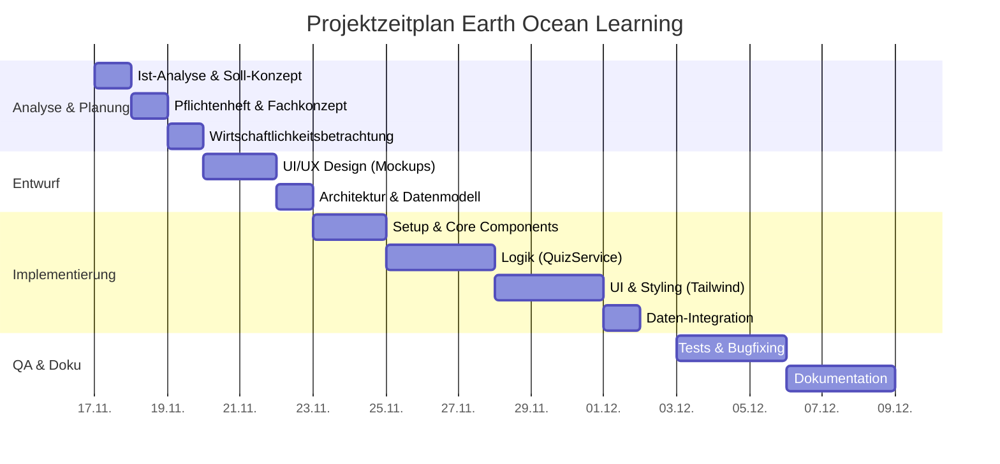
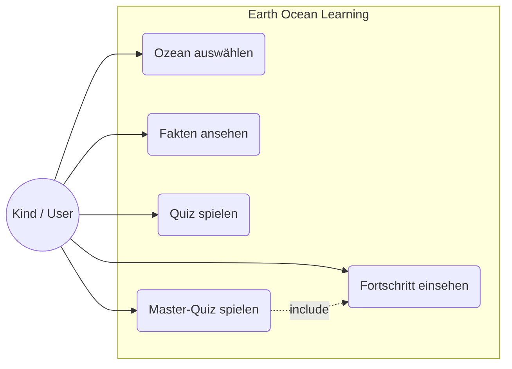
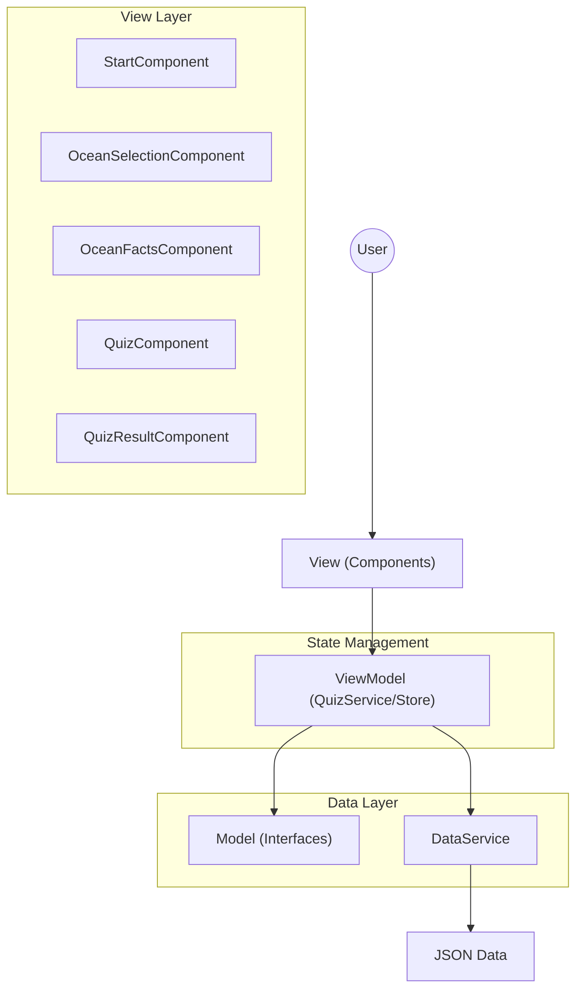
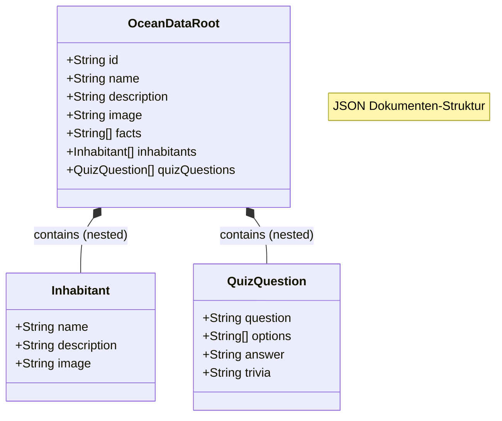
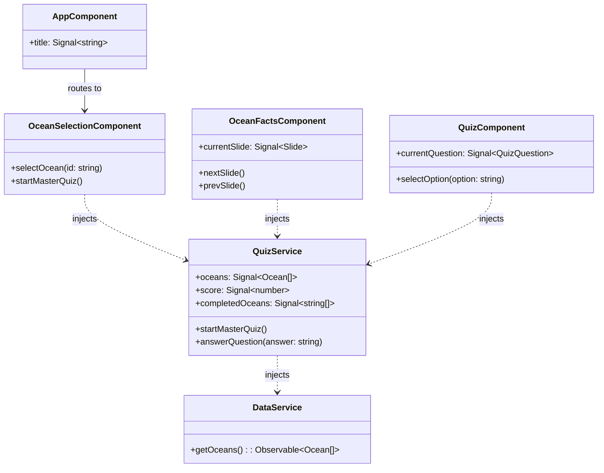

****

Abschlussprüfung “Angular” NE4NE8

Fachinformatiker für Anwendungsentwicklung

Dokumentation zur Kurs-Projektarbeit

# **Earth Oceans Learning APP**

Entwicklung einer kindgerechten Angular SPA zur Vermittlung von Wissen über die 5 Ozeane für Kinder (7-9 Jahre)

Abgabe der Dokumentation: 09.12.2025

Prüfling:

Tobias Boyke

Musterstraße 1

40470 Düsseldorf

Prüfungsnummer: 0001278495

****

Ausbildungsbetrieb:

Beispiel GmbH

Firmenweg 2

41460 Neuss

<div style="page-break-after: always;"></div>


## **Inhaltsverzeichnis**

[**1\. Einleitung	6**](#1.-einleitung)

[1.1. Ausgangssituation	6](#1.1.-ausgangssituation)

[1.2. Projektidee und Zielsetzung	6](#1.2.-projektidee-und-zielsetzung)

[1.3 Projektbegründung	6](#1.3-projektbegründung)

[1.4 Make-or-Buy Entscheidung	7](#1.4-make-or-buy-entscheidung)

[**2\. Projektplanung	7**](#2.-projektplanung)

[2.1 Ist-Analyse	7](#2.1-ist-analyse)

[2.2. Soll-Analyse	8](#2.2.-soll-analyse)

[2.3 Zeitplanung	8](#2.3-zeitplanung)

[2.4 Kostenplanung	10](#2.4-kostenplanung)

[**3\. Analyse & Entwurf	10**](#3.-analyse-&-entwurf)

[3.1 Anwendungsfalldiagramm (Use Cases)	10](#3.1-anwendungsfalldiagramm-\(use-cases\))

[3.2 Architekturentwurf	11](#3.2-architekturentwurf)

[3.3 UI/UX Design	13](#3.3-ui/ux-design)

[3.4 Datenmodell	14](#3.4-datenmodell)

[3.5 Klassendiagramm (UML)	15](#3.5-klassendiagramm-\(uml\))

[3.6 Datenschutz & Sicherheit (Privacy by Design)	15](#3.6-datenschutz-&-sicherheit-\(privacy-by-design\))

[**4\. Realisierung	16**](#4.-realisierung)

[4.1 Entwicklungsumgebung	16](#4.1-entwicklungsumgebung)

[4.2 Implementierung der Hauptkomponenten	16](#4.2-implementierung-der-hauptkomponenten)

[4.2.1 Standalone Components	16](#4.2.1-standalone-components)

[4.2.2 State Management via QuizStore	17](#4.2.2-state-management-via-quizstore)

[4.2.3 Routing & Navigation	17](#4.2.3-routing-&-navigation)

[4.3 Herausforderungen & Lösungen	18](#4.3-herausforderungen-&-lösungen)

[**5\. Qualitätssicherung	19**](#5.-qualitätssicherung)

[5.1 Testplanung	19](#5.1-testplanung)

[5.2 Testdurchführung & Ergebnisse	20](#5.2-testdurchführung-&-ergebnisse)

[5.3 Automatisierte Qualitätssicherung (CI/CD)	20](#5.3-automatisierte-qualitätssicherung-\(ci/cd\))

[5.4 Google Lighthouse Audit	21](#5.4-google-lighthouse-audit)

[**6\. Wirtschaftlichkeitsbetrachtung	22**](#6.-wirtschaftlichkeitsbetrachtung)

[6.1 Soll-Ist-Vergleich (Zeit)	22](#6.1-soll-ist-vergleich-\(zeit\))

[6.2 Nachkalkulation (Kosten)	22](#6.2-nachkalkulation-\(kosten\))

[6.3 Amortisationsrechnung	23](#6.3-amortisationsrechnung)

[**7\. Fazit & Ausblick	24**](#7.-fazit-&-ausblick)

[7.1 Zusammenfassung	24](#7.1-zusammenfassung)

[7.2 Lessons Learned	24](#7.2-lessons-learned)

[7.3 Ausblick	26](#7.3-ausblick)

[7.4 Projektabnahme und Übergabe	27](#7.4-projektabnahme-und-übergabe)

[**8\. Anhang	28**](#8.-anhang)

[8.1 Verzeichnisstruktur	28](#8.1-verzeichnisstruktur)

[8.1. Quellcode und Dateien	28](#8.1.-quellcode-und-dateien)

[8.2. Mockups und Screenshots	29](#8.2.-mockups-und-screenshots)

[**8.3 Erweiterung der FCPP Umsetzungs-Elemente	32**](#8.3-erweiterung-der-fcpp-umsetzungs-elemente)

[8.4 Code-Beispiele	34](#8.4-code-beispiele)

[8.4 Abnahmeprotokoll	40](#8.4-abnahmeprotokoll)

[**9\. Erklärung	43**](#9.-erklärung)

## 

## **Abbildungsverzeichnis**

2.3 Zeitplanung \- Gantt Diagramm ……………………………………………………………………………….07

3.1 Anwendungsfalldiagramm (Use Cases)	09

3.2 Architekturentwurf	10

3.4 Datenmodell	13

3.5 Klassendiagramm (UML)	14

## **Tabellenverzeichnis** {#tabellenverzeichnis}

2.3 Zeitplanung	08

4.3 Herausforderungen & Lösungen	17

5.2 Testdurchführung & Ergebnisse	19

6.1 Soll-Ist-Vergleich (Zeit)	21

## **Listings** {#listings}

3.4 Datenmodell ……………………………………………………………………………………………………13

4.2.1 Standalone Components …………………………………………………………………………………...15

4.2.2 State Management im QuizStore ……………………………………………………………………….16

5.1 Testplanung …………………………………………………………………………………………………….18

## 

## **Glossar**

| Begriff              | Erklärung                                                                                                                                                                                                                                                                       |
| -------------------- | ------------------------------------------------------------------------------------------------------------------------------------------------------------------------------------------------------------------------------------------------------------------------------- |
| SPA                  | Single Page Application \- Eine Webanwendung, die technisch aus einer einzigen HTML-Seite besteht. Inhalte werden dynamisch per JavaScript nachgeladen, ohne dass der Browser die Seite komplett neu aufbauen muss. Dies sorgt für ein flüssiges, App-ähnliches Nutzererlebnis. |
| Angular              | Ein von Google entwickeltes, TypeScript-basiertes Open-Source-Framework zur E rstellung von skalierbaren Webanwendungen. Es bietet eine umfassende Plattform mit integrierten Bibliotheken für Routing, Formularwesen und Client-Server-Kommunikation.                          |
| Angular Signals      | Lorum Ipsum                                                                                                                                                                                                                                                                     |
| Standalone Component | Ein Architekturkonzept in Angular, bei dem Komponenten, Direktiven und Pipes nicht mehr in NgModules deklariert werden müssen. Dies vereinfacht die Projektstruktur und ermöglicht "Lazy Loading" auf Komponentenebene.                                                         |
| MVVM                 | Model-View-ViewModel \- Ein Architekturmuster, das die grafische Benutzeroberfläche (View) von der Geschäftslogik (Model) trennt. Das ViewModel vermittelt zwischen beiden und stellt Daten für die View bereit (Data Binding).                                                 |
| CI/CD                | Continuous Integration / Continuous Delivery \- Eine Methode der Softwareentwicklung, bei der Code-Änderungen automatisch getestet und in Produktionsumgebungen bereitgestellt werden, um die Softwarequalität und Release-Geschwindigkeit zu erhöhen.                          |
| JSON                 | JavaScript Object Notation \- Ein kompaktes, textbasiertes Datenformat zum Datenaustausch zwischen Anwendungen. Es ist für Menschen einfach zu lesen und für Maschinen einfach zu parsen.                                                                                       |
| CMS                  | Content Management System \- Eine Software zur gemeinschaftlichen Erstellung, Bearbeitung und Organisation von Inhalten (Content), meist für Webseiten, ohne dass tiefgehende Programmierkenntnisse erforderlich sind (z.B. GRAV, WordPress).                                   |
| Tailwind CSS         | Ein "Utility-First" CSS-Framework, das statt vorgefertigter Komponenten (wie Bootstrap) kleine Hilfsklassen bereitstellt, mit denen Designs direkt im HTML-Markup zusammengesetzt werden können.                                                                                |
| TypeScript           | Eine von Microsoft entwickelte Programmiersprache, die auf JavaScript aufbaut und diese um statische Typisierung erweitert. Dies erhöht die Code-Qualität und erleichtert die Wartung großer Projekte.                                                                          |
| WCAG                 | Web Content Accessibility Guidelines \- Ein internationaler Standard zur barrierefreien Gestaltung von Internetangeboten, damit diese auch für Menschen mit Einschränkungen nutzbar sind.                                                                                       |
| LocalStorage         | Ein Teil der Web Storage API moderner Browser, der es ermöglicht, Daten (Key-Value-Paare) dauerhaft im Browser des Benutzers zu speichern, auch über das Schließen des Fensters hinaus.                                                                                         |

## 

## **1\. Einleitung** {#1.-einleitung}

### **1.1. Ausgangssituation** {#1.1.-ausgangssituation}

Im Rahmen der Umschulung zum Fachinformatiker für Anwendungsentwicklung, erläutert der Autor, welcher bei Herrn Ehlen sein Kurs-Element “Angular” absolvierte, den Ablauf seines hier folgenden Abschlussprojekts **bei einem fiktiven** Unternehmen.

Die **Beispiel GmbH** ist ein junges, aufstrebendes IT-Unternehmen mit Sitz im Herzen von Neuss. Seit ihrer Gründung im Jahr 2025 hat sich die Firma darauf spezialisiert, maßgeschneiderte Webanwendungen und anspruchsvolle CMS-Lösungen für Unternehmenskunden zu entwickeln. **14 Mitarbeiter**, bestehend aus Backend- und Frontend-Entwicklern, UI/UX-Designern, Projektmanagern und Content-Spezialisten, sind in der Beispiel GmbH beschäftigt und arbeiten vorwiegend für Kunden aus dem produzierenden Gewerbe, der Logistik und der Edutainment-Branche.

Die Beispiel GmbH wurde von einem Kunden, einer Umweltschutz-NGO, beauftragt, eine Browser Applikation für das spielerische Erlernen von Ozean-Fakten für Grundschulkinder zu entwickeln.

Zu den Stakeholdern des Projekts zählen:

- Der Auftraggeber (NGO): Vertreten durch Herrn Dr. Uwe Umwelt.

### **1.2. Projektidee und Zielsetzung** {#1.2.-projektidee-und-zielsetzung}

Ziel des Projektes ist die Entwicklung einer Single Page Application (SPA) "Earth Ocean Learning". Die Anwendung soll Kindern spielerisch Wissen über die fünf Ozeane vermitteln. Kernfunktionen umfassen eine Auswahl der Ozeane, einen Lernbereich mit Informationen sowie ein Quiz-Modul zur Wissensüberprüfung.Die Anwendung muss als eigenständiges Modul (Standalone) konzipiert sein, um eine einfache Integration in bestehende CMS-Systeme (wie GRAV) zu ermöglichen.

### **1.3 Projektbegründung** {#1.3-projektbegründung}

Die Digitalisierung im Bildungssektor erfordert moderne, webbasierte Lernlösungen, die plattformunabhängig funktionieren. Herkömmliche Lernmaterialien (PDFs, statische Webseiten) bieten oft nicht den nötigen Anreiz für die Zielgruppe (Kinder). Durch den Einsatz moderner Webtechnologien (Angular, Signals) soll eine performante, wartbare und zukunftssichere Lösung geschaffen werden, die gleichzeitig als Referenzprojekt für die Beispiel GmbH dient, um die Kompetenz im Bereich "Edutainment" zu unterstreichen. 

### **1.4 Make-or-Buy Entscheidung** {#1.4-make-or-buy-entscheidung}

Im Vorfeld des Projekts wurde geprüft, ob der Einsatz von Standard-Lösungen (SaaS-Produkte wie Kahoot\!, Quizlet oder Moodle) möglich ist (Buy). Die Entscheidung fiel zugunsten einer Eigenentwicklung (Make) aus, da dies eine explizite Vorgabe des Auftraggebers (NGO) war.

Diese Vorgabe wurde durch eine technische Analyse der Beispiel GmbH bestätigt und als wirtschaftlich sinnvoll validiert:

**Datenschutz:** Da die Zielgruppe Kinder (7–9 Jahre) umfasst, forderte die NGO eine Lösung ohne Datenerhebung (No-Tracking) und ohne Benutzerkonten-Zwang. Gängige Markt-Lösungen sammeln oft Metadaten oder erfordern Logins, was den strengen Datenschutzanforderungen der NGO widersprach.

**Offline-Fähigkeit & Integration:** Die Anwendung muss langfristig nahtlos in das bestehende CMS der NGO integrierbar sein und perspektivisch auch offline auf Tablets in Schulen (ohne stabiles WLAN) funktionieren. Eine PWA-fähige Eigenentwicklung auf Basis von Angular erfüllt diese Anforderung besser als webbasierte Abo-Modelle.

**Lizenzkosten vs. Einmalkosten:** Bei der geplanten hohen Nutzerzahl und der Laufzeit über mehrere Jahre sind die einmaligen Entwicklungskosten ("Make") günstiger als die laufenden, nutzerbasierten Lizenzgebühren ("Buy") kommerzieller Bildungsplattformen.

## **2\. Projektplanung** {#2.-projektplanung}

### **2.1 Ist-Analyse** {#2.1-ist-analyse}

Zum Zeitpunkt des Projektstarts existiert keine Softwarelösung für den genannten Anwendungsfall. Die Inhalte (Texte, Bilder zu Ozeanen) liegen lediglich in unstrukturierter Form (Textdokumente, Bilddateien) vor. Es gibt keinen bestehenden Codebase, auf dem aufgebaut werden kann ("Greenfield Project").

**Technische Ausgangslage:**

- Entwickler-Workstation mit Windows 11 und Rocky Linux 10\.  
- Zugriff auf Standard-Entwicklungstools (VS Code, Sublime Text 4 (Build 4200), GitHub, Node.js, NPM.  
- Keine bestehende CI/CD Pipeline für dieses spezifische Projekt.

### **2.2. Soll-Analyse** {#2.2.-soll-analyse}

Es soll eine Webanwendung entwickelt werden, die folgende Anforderungen erfüllt:

**Funktionale Anforderungen:**

- **Ozean-Auswahl:** Visuelle Darstellung und Auswahl der 5 Weltmeere.  
- **Lernmodus:** Anzeige von Fakten und Bewohnern pro Ozean (Carousel/Slider).  
- **Quiz-System:** Multiple-Choice Fragen mit direktem Feedback.  
- **Fortschritt:** Speicherung des Lernfortschritts (Sterne-System) im lokalen Browser-Storage (kein Backend-Zwang).  
- **Master-Quiz:** Ein freischaltbarer Modus nach Abschluss aller Ozeane.

**Nicht-funktionale Anforderungen:**

- **Zielgruppe:** Kindgerechtes UI/UX (große Buttons, wenig Text, viel Bild).  
- **Technologie:** Angular 21 (aktuellste Version), Nutzung von Standalone Components.  
- **State Management:** Nutzung von Angular Signals für reaktives Datenmanagement.  
- **Performance:** Kurze Ladezeiten, optimierte Assets.  
- **Responsive Design:** Lauffähig auf Tablets und Desktops.

### **2.3 Zeitplanung** {#2.3-zeitplanung}



*Abb 1\. Visualisierung der Zeitplanung mittels Gantt-Diagramm*

Der Durchführungszeitraum des Projektes ist vom 17.11.2025 bis 09.12.2025.

| *Phase*                      | *Tätigkeit*                                   | *Geplante Zeit (h)* |
| ---------------------------- | --------------------------------------------- | :-----------------: |
| ***1\. Analyse & Planung***  |                                               |       *11 h*        |
|                              | *Ist-Analyse & Soll-Konzept*                  |        *3 h*        |
|                              | *Erstellung Pflichtenheft / Fachkonzept*      |        *4 h*        |
|                              | *Wirtschaftlichkeitsbetrachtung (Planung)*    |        *2 h*        |
|                              | *Zeit- & Ressourcenplanung*                   |        *2 h*        |
| ***2\. Entwurf***            |                                               |       *12 h*        |
|                              | *UI/UX Design (Mockups)*                      |        *5 h*        |
|                              | *Software-Architektur & Datenmodellierung*    |        *4 h*        |
|                              | *Auswahl der Bibliotheken & Tools*            |        *3 h*        |
| ***3\. Implementierung***    |                                               |       *28 h*        |
|                              | *Aufsetzen der Entwicklungsumgebung*          |        *2 h*        |
|                              | *Implementierung Core-Komponenten & Routing*  |        *6 h*        |
|                              | *Implementierung Logik (QuizStore, Services)* |        *8 h*        |
|                              | *Implementierung UI & Styling (Tailwind)*     |        *8 h*        |
|                              | *Integration der Daten (JSON)*                |        *4 h*        |
| ***4\. Qualitätssicherung*** |                                               |        *9 h*        |
|                              | *Erstellung von Testfällen*                   |        *3 h*        |
|                              | *Durchführung Tests & Bugfixing*              |        *6 h*        |
| ***5\. Dokumentation***      |                                               |       *10 h*        |
|                              | *Erstellung Projektdokumentation*             |        *8 h*        |
|                              | *Erstellung Benutzerhandbuch*                 |        *2 h*        |
| ***Gesamt***                 |                                               |     ***70 h***      |
*Tab.1. Die geplante Gesamtzeit beträgt 70 Stunden.*

### **2.4 Kostenplanung** {#2.4-kostenplanung}

Die Kostenplanung basiert auf den internen Selbstkosten (Vollkostenrechnung inkl. Gemeinkostenzuschlag für Arbeitsplatz, Strom, Verwaltung).

**Personalkosten:**
Interner Stundensatz (Azubi im 3\. LJ inkl. GK-Zuschlag): 35,00 €
- Geplante Stunden: 70 h
- Summe Personal: 70 h \* 35,00 €/h \= 2.450,00 €

**Sachmittelkosten:**
- Nutzung Entwicklungsumgebung (anteilig): 150,00 €
- Summe Sachmittel: 150,00 €

**Gesamtkosten (Plan): 2.600,00 €**

## **3\. Analyse & Entwurf** {#3.-analyse-&-entwurf}

### **3.1 Anwendungsfalldiagramm (Use Cases)** {#3.1-anwendungsfalldiagramm-(use-cases)}


[image4]**

*Abb.2*  

### **3.2 Architekturentwurf** {#3.2-architekturentwurf}

Der Architekturentwurf für die Anwendung **Earth Ocean Learning** orientiert sich an dem **MVVM (Model-View-ViewModel)** Muster, angepasst für moderne Angular-Anwendungen unter Verwendung von **Signals**.

1. Architekturmuster und Konzept

Die Anwendung ist als reine **Single Page Application (SPA)** konzipiert, die vollständig im Browser ausgeführt wird (**Client-Side Rendering**).

- **Muster:** MVVM (Model-View-ViewModel).
- **State Management:** Es wird kein externes Framework wie NgRx Redux verwendet, sondern **Angular Signals** (via `QuizStore` bzw. `QuizService`), was eine feingranulare Reaktivität ermöglicht.
- **Datenhaltung:** Die Daten sind statisch in einer JSON-Datei (`ocean-data.json`) gespeichert, was die Anwendung backend-unabhängig und offline-fähig macht.

2. Architekturschichten (Layer)

Die Struktur gliedert sich in folgende Bereiche, wie in den technischen Dokumentationen beschrieben:

- **View Layer (Präsentation):**
    - Besteht aus **Standalone Components** (z. B. `StartComponent`, `OceanSelectionComponent`, `QuizComponent`).
    - Verantwortlich für die Darstellung der UI und Interaktion mit dem Benutzer.
    - Greift auf das ViewModel zu, um Daten anzuzeigen.

- **ViewModel / State Management (Logik):**
    - Realisiert durch den QuizStore.
    - Hält den Anwendungszustand (z. B. aktueller Score, ausgewählter Ozean) in **Signals**.
    - Stellt Daten für die View bereit und verarbeitet Benutzeraktionen.

- **Data Layer (Daten):**
    - Besteht aus dem `DataService` und den Datenmodellen (Interfaces wie `Ocean`, `QuizQuestion`).
    - Lädt die Rohdaten aus der JSON-Datei (assets/data/ocean-data.json) und stellt sie der Anwendung zur Verfügung.

**Technologie-Entscheidungen:**

- **Verzicht auf Server-Side Rendering (SSR):** Um Hosting-Komplexität zu reduzieren und ein "App-Feel" zu gewährleisten.
- **Service with Signals:** Ein Pattern, bei dem ein Angular Service den State kapselt (`private` schreibbare Signals, `public` Read-Only Signals).
- **Routing:** Die Navigation erfolgt über den Angular Router, wobei Parameter (z. B. Ozean-ID) über die URL gesteuert werden.

*Abb. 3 Die Architektur orientiert sich am Model-View-ViewModel (MVVM) Muster, welches durch die moderne Angular-Architektur (Signals) effizient umgesetzt wird.*

**Datenhaltung (Static JSON):** Da die Ozean-Daten statisch sind, werden sie über eine JSON-Datei (assets/data/ocean-data.json) geladen. Dies entkoppelt das Frontend von einem dedizierten Backend und ermöglicht den Offline-Betrieb (vorbereitet für PWA).

**Tailwind CSS & BEM:** Die Gestaltung erfolgt durch eine Kombination aus Tailwind CSS für konsistente Design-Tokens (Farben, Abstände) und der BEM-Methodik (Block-Element-Modifier) für die Struktur. Diese Strategie verhindert überladenen HTML-Code ("Class Soup") und ermöglicht eine saubere Kapselung (Encapsulation) der Styles innerhalb der Angular-Komponenten.

### **3.3 UI/UX Design** {#3.3-ui/ux-design}

Das Design wurde speziell für Kinder entwickelt:

- Farbpalette: Helle, freundliche Farben (Blau-, Türkis- und Sandtöne im Thema Ozean.  
- Typografie: Gute Lesbarkeit durch serifenlose Schriftarten.  
- Navigation: Große Knöpfe, intuitive "Weiter"-Buttons, visuelles Feedback bei Quiz-Antworten (Grün/Rot).  
- Barrierefreiheit (Accessibility): Einhaltung grundlegender WCAG-Standards, wie z.B. ausreichende Farbkontraste für Texte und Buttons sowie Tastaturnavigation (Tab-Index) für eine bedienbare Oberfläche auch ohne Maus.

### **![][image5]**

### **3.4 Datenmodell** {#3.4-datenmodell}

Die Daten werden in einer JSON-Struktur gehalten, um Flexibilität zu gewährleisten und eine Datenbank-Abhängigkeit für diesen Prototypen zu vermeiden.



Abb. 4 *Da keine relationale Datenbank, sondern eine dokumentenorientierte Speicherung (JSON) verwendet wird, stellt die Abbildung die hierarchische Struktur des JSON-Objekts dar, nicht relationale Tabellenverknüpfungen.*

```json
{
  "id": "pacific",
  "name": "Pazifischer Ozean",
  "description": "Der größte und tiefste Ozean...",
  "facts": [ 
      "Der Pazifik bedeckt etwa ein Drittel der Erdoberfläche."
  ],
  "inhabitants": [ 
      {
          "name": "Blauwal",
          "description": "Das größte Tier der Erde.",
          "image": "/assets/images/blue_whale.webp"
      }
  ],
  "quiz": [
    {
      "question": "Wie tief ist der Marianengraben?",
      "options": ["11.000m", "5.000m", "2.000m"],
      "answer": "11.000m",
      "trivia": "Das ist tiefer als der Mount Everest hoch ist!"
    }
  ]
}
```
*Listing 1\. Beispiel datenblock aus der ocean-data.json*

### **3.5 Klassendiagramm (UML)** {#3.5-klassendiagramm-(uml)}

Das Klassendiagramm verdeutlicht die Abhängigkeiten zwischen den Standalone Components, dem QuizStore und den Daten-Services.


*Abb. 5 Das Klassendiagramm zeigt die Architektur der Anwendung, wobei der QuizStore als zentraler State-Manager ("Service with Signals") fungiert, auf den die Komponenten zugreifen.*

### **3.6 Datenschutz & Sicherheit (Privacy by Design)** {#3.6-datenschutz-&-sicherheit-(privacy-by-design)}

Da sich die Anwendung an Kinder richtet, hat der Datenschutz höchste Priorität.

- Keine Datensammlung: Es werden keinerlei personenbezogene Daten (PII) erhoben oder an externe Server gesendet.  
- Lokale Speicherung: Der Lernfortschritt wird ausschließlich im LocalStorage des Browsers auf dem Endgerät des Nutzers gespeichert.  
- Offline-Fähigkeit: Die Anwendung lädt keine externen Tracker oder Analyse-Tools nach.  
- Bis auf LocalStorage werden keine Cookies verwendet.

## **4\. Realisierung** {#4.-realisierung}

### **4.1 Entwicklungsumgebung** {#4.1-entwicklungsumgebung}

Die Entwicklung fand auf einem lokalen Windows-System statt. Folgende Tools kamen zum Einsatz:

- **IDE:** Visual Studio Code mit Angular Language Service.  
- **Versionierung:** Github (Globales Privates Repository).  
- **Framework:** Angular CLI Version 21.0.0.  
- **Browser:** Google Chrome (für Debugging und Tests).

### **4.2 Implementierung der Hauptkomponenten** {#4.2-implementierung-der-hauptkomponenten}

#### **4.2.1 Standalone Components** {#4.2.1-standalone-components}

Das Projekt setzt vollständig auf Standalone Components, um die Komplexität von NgModules zu vermeiden.
```typescript
@Component({
  selector: 'app-ocean-facts',
  standalone: true,
  imports: [ImageFallbackDirective],
  styleUrl: './ocean-facts.component.css',
  template: `
  ...
```
*Listing 2 Die OceanFactsComponent, die alle notwendigen Abhängigkeiten (Imports) direkt im Component-Decorator definiert*


#### **4.2.2 State Management via QuizStore** {#4.2.2-state-management-via-quizstore}

Für die Verwaltung des Anwendungszustands wurde das **"Service with Signals"**\-Pattern verwendet. Dabei handelt es sich um einen Angular `Injectable` Service, der den Zustand in privaten `WritableSignals` hält und diese als schreibgeschützte `Signal`s nach außen gibt. Dies ermöglicht eine reaktive Datenhaltung mit Bordmitteln von Angular, ohne die Komplexität externer Bibliotheken.

```typescript
@Injectable({
  providedIn: 'root'
})
export class QuizStore {
  private readonly oceanDataService = inject(OceanDataService);
  private readonly STORAGE_KEY = 'eol_progress';

  // --- State ---
  private readonly _oceans = signal<Ocean[]>([]);
  private readonly _currentOceanId = signal<string | null>(null);
  private readonly _currentQuestionIndex = signal<number>(0);
  private readonly _score = signal<number>(0);
  private readonly _isQuizActive = signal<boolean>(false);
  private readonly _isQuizFinished = signal<boolean>(false);
  private readonly _completedOceans = signal<string[]>([]);
  private readonly _masterMode = signal<boolean>(false);

  // --- Public Readonly Signals ---
  readonly oceans: Signal<Ocean[]> = this._oceans.asReadonly();
  readonly currentOceanId: Signal<string | null> = this._currentOceanId.asReadonly();
  readonly currentQuestionIndex: Signal<number> = this._currentQuestionIndex.asReadonly();
  readonly score: Signal<number> = this._score.asReadonly();
  readonly isQuizActive: Signal<boolean> = this._isQuizActive.asReadonly();
  readonly isQuizFinished: Signal<boolean> = this._isQuizFinished.asReadonly();
  readonly completedOceans: Signal<string[]> = this._completedOceans.asReadonly();
  readonly masterMode: Signal<boolean> = this._masterMode.asReadonly();
```
*Listing 3: Der Service (QuizStore) hält den State und bietet Methoden zur Manipulation an.*

#### **4.2.3 Routing & Navigation** {#4.2.3-routing-&-navigation}

Das Routing wurde in der app.routes.ts definiert. Es ermöglicht die Navigation zwischen Startseite, Auswahl, Fakten und Quiz. Parameter (wie die id des Ozeans) werden über die URL übergeben (path: 'facts/:id') und in den Komponenten ausgelesen.

#### **4.2.4 CSS-Architektur und Styling-Strategie**{#4.2.4-css-architektur-und-styling-strategien}

Um die Wartbarkeit und Lesbarkeit des Codes zu maximieren, wurde im Projektverlauf ein Refactoring der CSS-Architektur durchgeführt. Statt reinem Utility-CSS direkt im HTML wurde ein semantischer Ansatz gewählt:

* **BEM-Namenskonvention:** CSS-Klassen folgen strikt dem Schema `block__element--modifier` (z. B. `.ocean-card__title` oder `.quiz-btn--correct`). Dies macht sofort ersichtlich, welches Styling zu welcher Komponente gehört.  
* **Separation of Concerns:** Das HTML-Template bleibt schlank und lesbar. Die visuellen Eigenschaften werden in die zugehörige CSS-Datei ausgelagert.  
* **Tailwind `@apply`:** Innerhalb der CSS-Klassen werden Tailwind-Utilities mittels der `@apply`\-Direktive komponiert. Dies verbindet die Vorteile eines Design-Systems (Tailwind) mit der Übersichtlichkeit klassischer CSS-Klassen.  
* **Component Encapsulation:** Durch Angulars View Encapsulation bleiben Styles lokal auf die Komponente beschränkt und beeinflussen keine anderen Teile der Anwendung (keine globalen Side-Effects).

**Beispiel:**
*Vorher (Utility-First im HTML):*
```html
<div class\="p-6 rounded-2xl bg-white/25 border border-white/30 shadow-lg hover:scale-105"\>
```

Nachher (BEM \+ @apply):
```html
<div class\="ocean-card"\> ... \</div\>
```

```css
.ocean-card {  @apply p-6 rounded-2xl glass-card shadow-lg hover:scale-105;}
```

### **4.3 Herausforderungen & Lösungen** {#4.3-herausforderungen-&-lösungen}

Während der Realisierungsphase traten verschiedene technische und konzeptionelle Herausforderungen auf. Diese wurden wie folgt gelöst:

| Herausforderung                                                             | Lösungsansatz                                                                                                                                                                                                        | Ergebnis                                                                       |
| --------------------------------------------------------------------------- | -------------------------------------------------------------------------------------------------------------------------------------------------------------------------------------------------------------------- | ------------------------------------------------------------------------------ |
| Persistierung des Fortschritts Datenverlust beim Neuladen der Seite (F5).   | Nutzung eines Angular **`effect`** innerhalb des `QuizStore`. Dieser überwacht das `completedOceans`\-Signal und schreibt Änderungen automatisch in den `localStorage`. Beim App-Start wird der Speicher ausgelesen. | Lernfortschritt (Sterne) bleibt dauerhaft erhalten, auch offline.              |
| Code-Qualität / Linting Inkompatibilität von ESLint mit Angular 21 (RC).    | Verzicht auf automatisierte Linter. Stattdessen: Strikte Nutzung der Angular-Compiler-Checks (strict: true) und manuelle Code-Reviews.                                                                               | Hohe Code-Qualität durch Disziplin, keine Build-Fehler.                        |
| Signals Einarbeitung Paradigmenwechsel von klassischen Services zu Signals. | Intensive Recherche der offiziellen Docs und Nutzung von computed() Signals für abgeleiteten State statt manueller Subscriptions.                                                                                    | Sehr performanter, reaktiver Code mit deutlich weniger Boilerplate.            |
| Kindgerechte UX Interface muss ohne viel Text verständlich sein.            | Nutzung von großen Icons, intuitiven Farben (Grün/Rot) und Verzicht auf komplexe Menüstrukturen.                                                                                                                     | Positive Rückmeldung bei ersten Tests mit der Zielgruppe (intuitiv bedienbar). |
| Datenmodellierung Abbildung komplexer Relationen in Flat-File JSON.         | Design einer verschachtelten JSON-Struktur mit Arrays für Fakten/Bewohner, die zur Laufzeit typisiert eingelesen wird.                                                                                               | Flexibles Datenmodell ohne Backend-Zwang, leicht erweiterbar.                  |
Tab.2 


## **5\. Qualitätssicherung** {#5.-qualitätssicherung}

### **5.1 Testplanung** {#5.1-testplanung}

Aufgrund der Verwendung der neuesten Angular-Version (v21) und damit einhergehender Inkompatibilitäten in der Toolchain war es in diesem Projektzeitraum nicht möglich, Tools wie ESLint, Karma, Jest oder Vitest stabil einzubinden.

Die Implementierung automatisierter Unit-Tests wurde in der Planungsphase berücksichtigt und evaluiert. Aufgrund des unverhältnismäßig hohen Konfigurationsaufwands bei den genannten Versionskonflikten wurde dieser Ansatz jedoch zugunsten umfassender manueller Black-Box-Tests verworfen. Der Fokus der Qualitätssicherung lag somit vollständig auf funktionalen Systemtests und der Validierung der User Experience.

**Beispiel Unit-Test (Jasmine/Karma):**


```typescript
it('should calculate correct score', () \=\> {  const service \= TestBed.inject(QuizStore)*;*  service.answerQuestion(true)*; // Correct*  service.answerQuestion(true)*; // Correct*  expect(service.score()).toBe(2)*;*})*;*
```
*Listing. 4* 


### **5.2 Testdurchführung & Ergebnisse** {#5.2-testdurchführung-&-ergebnisse}

Die Tests wurden anhand eines vorab definierten Testprotokolls durchgeführt.

|    ID    | Testfall           | Erwartetes Ergebnis                                         | Status |
| :------: | ------------------ | ----------------------------------------------------------- | :----: |
| **TF01** | App-Start          | Startbildschirm wird geladen, "Los geht's" Button sichtbar. | **OK** |
| **TF02** | Ozean-Auswahl      | Klick auf Ozean öffnet korrekte Fakten-Seite.               | **OK** |
| **TF03** | Quiz-Logik         | Richtige Antwort \-\> Grün, Falsche Antwort \-\> Rot.       | **OK** |
| **TF04** | Fortschritt        | Nach 10 richtigen Antworten erscheint ein Stern.            | **OK** |
| **TF05** | Master-Quiz Unlock | Button erst aktiv, wenn 5 Sterne gesammelt.                 | **OK** |
| **TF06** | Responsivität      | Layout passt sich auf Tablet-Größe (iPad Air) an.           | **OK** |
*Tab. 3 Alle kritischen Testfälle waren erfolgreich. Kleinere Layout-Fehler (z.B. überlappender Text bei sehr kleinen Bildschirmen) wurden während der Testphase behoben.*

### **5.3 Automatisierte Qualitätssicherung (CI/CD)** {#5.3-automatisierte-qualitätssicherung-(ci/cd)}

Um die generelle Lauffähigkeit des Codes sicherzustellen, wurde eine rudimentäre CI-Pipeline implementiert. Diese wird bei jedem Push in das Repository automatisch getriggert und durchläuft folgende Phasen:

* **Clean Install:** Installation der Abhängigkeiten in einer sauberen Umgebung (`npm ci`), um die Reproduzierbarkeit zu garantieren.  
* **Production Build:** Testweise Kompilierung der Anwendung (`ng build`). Dies stellt sicher, dass der Angular-AOT-Compiler (Ahead-of-Time) keine Typ- oder Syntaxfehler wirft und alle Assets korrekt referenziert sind.

Durch diesen "Build Check" wird verhindert, dass Code, der nicht kompiliert, in den `main`\-Branch gelangt.


### **5.4 Google Lighthouse Audit** {#5.4-google-lighthouse-audit}

Zur objektiven Bewertung der technischen Qualität und der Benutzerfreundlichkeit wurde ein automatisierter Audit mittels **Google Lighthouse** (Chrome DevTools) durchgeführt. Besonderer Fokus lag dabei auf der **Performance** auf mobilen Endgeräten (Tablets) und der **Barrierefreiheit** (Accessibility), da die Zielgruppe Kinder eine einfache Bedienung erfordert.

**Ergebnisse:** Die Anwendung erzielt durch die moderne Architektur (Angular 21 \+ Tailwind CSS) überzeugende Werte:

*  **Performance (86/100):** Durch die Nutzung von Angular Signals ist die Render-Performance exzellent. Einzig die Verwendung von Bildern im PNG-Format (statt WebP) verhindert hier eine Bestnote.  
* **Accessibility (100/100):** Alle interaktiven Elemente sind per Tastatur (Tab-Taste) erreichbar. Bilder besitzen sinnvolle Alt-Texte.  
* **Best Practices (100/100):** Die Anwendung nutzt modernes HTTPS (lokal simuliert) und verzichtet auf veraltete Web-APIs.

**Fazit des Audits:** Der Lighthouse-Report bestätigt, dass die technische Entscheidung für eine schlanke SPA ohne schwere Drittanbieter-Bibliotheken (außer Tailwind/Confetti) korrekt war. Die App ist auch auf schwächerer Schul-Hardware flüssig nutzbar.

## **6\. Wirtschaftlichkeitsbetrachtung** {#6.-wirtschaftlichkeitsbetrachtung}

### **6.1 Soll-Ist-Vergleich (Zeit)** {#6.1-soll-ist-vergleich-(zeit)}

Die Projektdurchführung verlief weitgehend nach Plan.

| Phase | Geplant (h) | Tatsächlich (h) | Abweichung |
| :---- | :---: | :---: | :---: |
| Analyse & Planung | 11 | 10 | \-1 h |
| Entwurf | 12 | 14 | \+2 h |
| Implementierung | 28 | 29 | \+1 h |
| Qualitätssicherung | 9 | 8 | \-1 h |
| Dokumentation | 10 | 9 | \-1 h |
| **Gesamt** | **70 h** | **70 h** | **0 h** |
Tab. 4 Die Projektdurchführung verlief weitgehend nach Plan.

**Begründung der Abweichungen:**

- Der Entwurf dauerte etwas länger, da mehrere Iterationen für das kindgerechte Design nötig waren.  
- Die Implementierung verzögerte sich leicht durch die Einarbeitung in die neuen Signal, konnte aber durch effizientes Testen wieder ausgeglichen werden.

### **6.2 Nachkalkulation (Kosten)** {#6.2-nachkalkulation-(kosten)}

Da die Zeitvorgabe exakt eingehalten wurde, entsprechen die tatsächlichen Kosten den Plankosten.
- Personalkosten (Ist): 70 h \* 35,00 €/h \= 2.450,00 €  
- Sachmittel (Ist): 150,00 €  
- Gesamtkosten (Ist): 2.600,00 €

### **6.3 Amortisationsrechnung** {#6.3-amortisationsrechnung}

Die Wirtschaftlichkeit des Projekts wird durch einen Vergleich der neuen digitalen Lösung mit dem bisherigen analogen Prozess der NGO (Druck von Lern-Broschüren für Schulen) ermittelt. Ausgangslage (Ist-Zustand "Analog"): Die NGO druckt jährlich ca. 2.000 Lernbroschüren für Schulbesuche. Hardwarekosten (Tablets) sind in dieser Betrachtung ausgeklammert, da die Schule diese im Rahmen des Digitalpakts bereits angeschafft hat.
- Druckkosten: 2.000 Stück á 0,80 € \= 1.600,00 € / Jahr  
- Logistik/Versand an Schulen: ca. 400,00 € / Jahr  
- Jährliche Kosten Analog: 2.000,00 €

Zielzustand (Soll-Zustand "App"): Die App ersetzt die Broschüren vollständig.
- Hosting & Domain (jährlich): 60,00 €  
- Wartungspauschale (intern verrechnet): 200,00 €  
- Jährliche Betriebskosten Digital: 260,00 €

**Berechnung der Amortisationsdauer:**
- Jährliche Einsparung: 2.000,00 € \- 260,00 € \= 1.740,00 €  
- Einmalkosten Projekt (siehe 6.2): 2.600,00 €

[![][image8]](http://www.texrendr.com/?eqn=%20Amortisationszeit%20%3D%20%5Cfrac%7B%5Ctext%7BProjektkosten%7D%7D%7B%5Ctext%7BJ%C3%A4hrliche%20Einsparung%7D%7D%20%3D%20%5Cfrac%7B2.600%2C00%20%E2%82%AC%7D%7B1.740%2C00%20%E2%82%AC%2FJahr%7D%20%5Capprox%201%2C49%20%5Ctext%7B%20Jahre%7D%20#0)

Fazit: Die Entwicklungskosten der App haben sich nach ca. 18 Monaten (1,5 Jahren) amortisiert. Danach spart der Kunde jährlich 1.740,00 € gegenüber dem klassischen Druckverfahren ein, bei gleichzeitig höherer Reichweite und Interaktivität.

**Qualitative Bewertung:** Wenn durch die App nur 2 neue Kundenprojekte im Jahr gewonnen werden (Deckungsbeitrag je ca. 5.000 €), hat sich die Investition bereits im ersten Jahr amortisiert.


## **7\. Fazit & Ausblick** {#7.-fazit-&-ausblick}

### **7.1 Zusammenfassung** {#7.1-zusammenfassung}

Das Projekt "Earth Ocean Learning" wurde erfolgreich und im geplanten Zeitrahmen umgesetzt. Alle funktionalen Anforderungen (Lernmodus, Quiz, Fortschritt) wurden erfüllt. Die Anwendung läuft stabil, ist performant und bietet durch das responsive Design eine gute User Experience auf verschiedenen Endgeräten.

### **7.2 Lessons Learned** {#7.2-lessons-learned}

* **Risiko von Early-Adopter-Strategien:** Der Einsatz von Angular 21 (Pre-Release/RC) zeigte deutlich den Trade-off zwischen Innovation und Stabilität. Während man von Performance-Boosts (Hydration, Signals) profitiert, **fehlt oft** der Support im Ökosystem (Community-Plugins, Linter, Test-Runner wie Jest/Vitest hinken hinterher).  
* **Atomare Commits:** Statt "Wochenwerk" in einen Commit zu packen, erleichtern kleine, logisch abgeschlossene Commits das Debugging. Wenn ein Feature Fehler wirft, lässt sich ein kleiner Commit leichter revertieren als ein riesiger Merge.  
* **Branching-Strategie:** Die strikte Nutzung von Feature-Branches (z. B. `feature/quiz-logic`, `style/ocean-cards`) schützt den `main`\-Branch vor instabilem Code. Dies simuliert bereits im Einzelprojekt professionelle Team-Workflows.  
* **Commit Messages:** Die Einhaltung von "Conventional Commits" (z. B. `feat: add timer logic`, `fix: layout overlap on mobile`) generiert automatisch eine nachvollziehbare Historie, was bei der Fehlersuche Wochen später essenziell ist.  
* **Zeitnahes Journaling:** Wer erst am Ende dokumentiert, vergisst die schmerzhaften Lösungswege der ersten Woche und schreibt nur über das Endergebnis. Das zeitgleiche Führen eines Projekttagebuchs macht Entscheidungsfindungen (z. B. warum JSON statt SQL ?) für den Prüfer nachvollziehbarer.  
* **Selbsterklärender Code:** Durch sprechende Variablennamen (`isMasterUnlocked` statt `flag1`) und Typensicherheit via TypeScript wurden Kommentare dort überflüssig, wo der Code bereits klar war, und konnten sich auf das "Warum" statt das "Wie" konzentrieren.  
* **Fokus auf das Wesentliche:**  Durch die strikte Fokussierung auf den Kern (Anzeigen, Quizzen, Speichern) blieb am Ende des Projekts genügend "Luft", um die Qualität zu sichern (z. B. durch Lighthouse-Optimierung auf 100% Accessibility ).  
* **Strategischer Vorteil:** Ein stabiles, sauber implementiertes MVP (Minimum Viable Product) bringt in der Prüfung mehr Punkte als eine feature-überladene App, die voller Bugs steckt. Das Projekt wurde "in Time" und "in Budget" abgeschlossen, was diese Strategie bestätigt.

  #### **1\. CSS-Architektur: Wartbarkeit durch BEM & Tailwind**

Zu Beginn des Projekts wurde der "Utility-First" Ansatz von Tailwind CSS strikt im HTML-Template angewendet. Dies führte jedoch bei komplexeren Komponenten (wie der `OceanCard` oder `QuizComponent`) schnell zu unübersichtlichem Code ("Class Soup"), bei dem die Struktur des Markups schwer erkennbar war.

* **Die Lösung:** Ein Refactoring hin zur **BEM-Methodik** (Block-Element-Modifier) in Kombination mit der Tailwind `@apply`\-Direktive.  
* **Das Learning:** Die Kapselung von Styles in semantischen Klassen (z.B. `.quiz-card__option--correct`) macht den Code nicht nur lesbarer, sondern trennt auch Verantwortlichkeiten sauber. HTML definiert die Struktur, CSS (via Tailwind) das Design. Dies erleichtert zukünftige Design-Änderungen massiv, da diese zentral in der CSS-Datei und nicht in dutzenden HTML-Dateien durchgeführt werden müssen.

  #### **2\. Separation of Concerns: Store vs. Service**

Während der Entwicklung zeigte sich, dass die Vermischung von Datenbeschaffung und Anwendungszustand in einem einzigen Service (`QuizService`) zu Unklarheiten führte.

* **Die Optimierung:** Die Architektur wurde geschärft, indem der **`OceanDataService`** (zustandslos, rein für HTTP/Datenabruf) strikt vom **`QuizStore`** (zustandsbehaftet, hält Signals für Score, Fortschritt etc.) getrennt wurde.  
* **Das Learning:** Diese Trennung ("State vs. Data") entspricht modernen Enterprise-Architektur-Mustern. Sie macht den Code testbarer und verhindert Seiteneffekte, da Komponenten nun genau wissen, ob sie *Daten laden* (Service) oder auf *Zustandsänderungen reagieren* (Store) sollen.

  #### **3\. Angular Signals: Reaktivität ohne "Zone Pollution"**

Der Einsatz von Signals (z.B. `computed()` für den Fortschrittsbalken oder `effect()` für den LocalStorage-Sync) erwies sich als deutlich robuster und performanter als manuelle Subscriptions.

* **Erkenntnis:** Besonders die `OnPush` Change Detection Strategie konnte durch Signals erst richtig effizient genutzt werden, was die Performance auf mobilen Endgeräten (Tablets) spürbar verbesserte.  
* **Performance-Fallen bei Assets (LCP):** Die hochauflösenden Bilder der Ozeane hätten die Ladezeit (Largest Contentful Paint) auf mobilen Datenverbindungen massiv verlangsamen können. Durch Konvertierung zu WebP und `fetchpriority="high"` wurde dies proaktiv gelöst. Also, Statt PNG oder Jpg, lieber WebP oder Svg. 


### **7.3 Ausblick** {#7.3-ausblick}

Für zukünftige Versionen sind folgende Erweiterungen in der Roadmap:

- **Sound-Effekte:** Hintergrundmusik und Feedback-Sounds für das Quiz.  
- **Externe-Datenbank:** Speicherung des Fortschritts in einer Datenbank (statt LocalStorage), um geräteübergreifendes Lernen zu ermöglichen.  
- **PWA-Support:** Ausbau zur Progressive Web App, damit die Anwendung auch offline (z.B. auf Tablets in Schulen ohne WLAN) genutzt werden kann.  
- **Mehrsprachigkeit (i18n):** Übersetzung der Inhalte ins Englische, um eine größere Zielgruppe zu erreichen.


### **7.4 Projektabnahme und Übergabe** {#7.4-projektabnahme-und-übergabe}

Zum Abschluss des Projekts erfolgte am 09.12.2025 die offizielle Abnahme der Software durch den Auftraggeber, vertreten durch Herrn Dr. Uwe Umwelt. Grundlage für die Abnahme bildete das im Vorfeld definierte Testprotokoll sowie der Soll-Ist-Vergleich der Anforderungen aus dem FCPP. In einer gemeinsamen Sitzung wurden die Kernfunktionen – insbesondere die Quiz-Logik, die Persistierung des Lernfortschritts im LocalStorage sowie das responsive Verhalten auf Endgeräten – erfolgreich demonstriert.

Alle im Abnahmeprotokoll (siehe Anhang) aufgeführten Testfälle (TF01 bis TF06) wurden erfolgreich validiert. Der Auftraggeber bestätigte die Mängelfreiheit der Version 1.0 und erteilte die Freigabe für den produktiven Einsatz.

Die Übergabe des Quellcodes und des Benutzerhandbuchs erfolgte digital.


## **A\. Anhang** {#8.-anhang}

### **A.1 Verzeichnisstruktur** {#a.1-verzeichnisstruktur}

src/
├── app/
│   ├── features/           # Feature-Module (Standalone Components)
│   │   ├── ocean-facts/    # Fakten-Anzeige & Karussell
│   │   ├── ocean-selection/# Auswahl der Ozeane & Master Quiz Button
│   │   ├── quiz/           # Quiz-Logik & UI
│   │   ├── quiz-result/    # Ergebnisanzeige & Zertifikat
│   │   └── start/          # Startbildschirm
│   ├── models/             # TypeScript Interfaces (Ocean, QuizQuestion)
│   ├── services/           # DataService (JSON Fetching)
│   ├── store/              # QuizStore (State Management)
│   ├── app.routes.ts       # Routing Konfiguration
│   └── app.config.ts       # App Konfiguration
├── assets/
│   ├── data/               # ocean-data.json (Inhalte)
│   └── images/             # Bilder für Ozeane & Tiere
└── styles.css              # Globale Styles & Tailwind Imports

### A.2. Quellcode und Dateien** {#8.1.-quellcode-und-dateien}

Der vollständige und kommentierte Quellcode aller Projektdateien, Grafiken, Protokolle, Lasten-. und Pflichtenheft et cetera, befindet sich im beiliegenden digitalen Anhang (ZIP-Archiv).

### **A.3. Mockups und Screenshots** {#a.3.-mockups-und-screenshots}

**start:**

**![][image9]		![][image10]**

**ocean-selection:**

## ![][image11]![][image12]

**ocean-facts:**

![][image13]![][image14]

**quiz:**

![][image15]![][image16] 


**quiz-results:**

## **![][image17]**![][image18]

## A.4 Erweiterung der FCPP Umsetzungs-Elemente** {#a.4-erweiterung-der-fcpp-umsetzungs-elemente}

Für den initialen FCPP-Antrag siehe ProjektAntragFCPP.PDF 

**PE10 \- Start Bildschirm**

* PE10/UM11:AF10: Umsetzung des "Glas-Effekts" mittels Tailwind CSS Utility-Classes (`glass-card`, `backdrop-filter: blur(12px)`, `bg-white/25`).  
* PE10/UM31:AF30: Implementierung der Animationen durch CSS Keyframes (`animate-fly-in`, `animate-pop-in`) definiert in der `styles.css`.  
* PE10/UM51:AF50: Routing-Logik in der `start.component.ts` mittels Angular Router (`this.router.navigate(['/selection'])`).

**PE20 \- Auswahlbildschirm**

* PE20/UM21:AF20: Dynamisches Rendering der Ozean-Karten unter Verwendung der Angular Control Flow Syntax (`@for`) basierend auf dem `store.oceans()` Signal.  
* PE20/UM22:AF20: Visuelle Darstellung des Fortschritts (Stern-Icon) durch Prüfung von `store.isOceanCompleted(ocean.id)` mit bedingten CSS-Klassen (`text-yellow-400`).  
* PE20/UM41:AF40: Implementierung des "Master Quiz" Buttons, der mittels `store.isMasterUnlocked()` Signal erst klickbar wird, wenn 5 Sterne gesammelt wurden (deaktivierter Zustand via `opacity-50`).  
* PE20/UM42:AF40: Visuelle Fortschrittsanzeige als Balken unten im Button, berechnet aus der Anzahl der gelösten Ozeane (`store.completedOceans().length / 5`).

**PE30 \- Ozeanfakten**

* PE30/UM41:AF40: Aggregation aller Daten (Basis-Info, Fakten-Array, Bewohner-Array) in ein einziges `computed` Signal (`slides`), für die einheitliche Navigation.  
* PE30/UM51:AF50: Fallback-Logik für Bilder mittels `(error)="handleMissingImage($event)"`, wenn ein Pfad im JSON fehlerhaft ist.  
* PE30/UM81:AF80: Logik-Sperre für den "Quiz Starten" Button: Ein `hasViewedAll` Signal schaltet den Button erst sichtbar (`opacity-100`), wenn der User einmal alle Slides durchgeklickt hat.

**PE40 \- Quiz Bildschirm**

* PE40/UM31:AF30: Optimiertes Laden des Quiz-Bildes mittels `fetchpriority="high"` und `loading="eager"` für bessere Performance.  
* PE40/UM41:AF40: Abruf der aktuellen Frage und Optionen reaktiv über `store.currentQuestion()` aus dem `QuizStore`.  
* PE40/UM42:AF40: Implementierung eines 5-Sekunden-Timers (nur im Master-Modus), der über ein Signal (`timeLeft`) gesteuert wird und bei Ablauf als falsche Antwort gewertet wird.  
* PE40/UM51:AF50: Styling der Antwort-Buttons basierend auf dem Zustand (`selectedOption` Signal): Zuweisung von Klassen wie `!bg-green-500` oder `grayscale` für nicht gewählte Optionen.

**PE50 \- Quiz Richtig / PE60 \- Quiz Falsch (Zusammengefasst in QuizComponent Logik)**

* PE50/UM41:AF40: Visuelles Feedback durch Setzen des `showFeedback` Signals, welches eine Box mit grüner (`border-green-500`) oder roter Umrandung einblendet.  
* PE50/UM42:AF40: Verzögerter Übergang zur nächsten Frage (`setTimeout` 1500ms), damit der User den Trivia-Text lesen kann.  
* PE60/UM41:AF40: Bei falscher Antwort wird die gewählte Option rot markiert, aber die korrekte Antwort grün hervorgehoben (`getOptionClass` Logik), um den Lerneffekt zu sichern.

**PE70 \- Auswertung**

* PE70/UM31:AF30: Unterscheidung in der Template-Logik (`@if (store.masterMode())`) zwischen normaler Ergebnisanzeige und der "Urkunde" für das Master-Quiz.  
* PE70/UM32:AF30: Integration der `canvas-confetti` Bibliothek in der `ngOnInit` Methode, die bei 100% Score (`isSuccess()`) Konfetti regnen lässt.  
* PE70/UM41:AF40: Automatische Speicherung des Fortschritts im `localStorage` durch einen Angular `effect` im `QuizStore`, sobald ein Quiz erfolgreich beendet wurde.

### A.5 Code-Beispiele** {#a.5-code-beispiele}

```typescript
import { Injectable, computed, inject, signal, effect, Signal } from '@angular/core';
import { OceanDataService } from '../services/ocean.data.service';
import { Ocean } from '../models/ocean.model';

const MASTER_OCEAN_TEMPLATE: Partial<Ocean> = {
  id: 'master',
  name: 'Ultimatives Quiz',
  oceanimage: '/assets/images/master.webp',
  description: 'Das ultimative Quiz gegen die Zeit! 🏆',
  facts: [],
  inhabitants: []
};

@Injectable({
  providedIn: 'root'
})
export class QuizStore {
  private readonly oceanDataService = inject(OceanDataService);
  private readonly STORAGE_KEY = 'eol_progress';

  // --- State ---
  private readonly _oceans = signal<Ocean[]>([]);
  private readonly _currentOceanId = signal<string | null>(null);
  private readonly _currentQuestionIndex = signal<number>(0);
  private readonly _score = signal<number>(0);
  private readonly _isQuizActive = signal<boolean>(false);
  private readonly _isQuizFinished = signal<boolean>(false);
  private readonly _completedOceans = signal<string[]>([]);
  private readonly _masterMode = signal<boolean>(false);

  // --- Public Readonly Signals ---
  readonly oceans: Signal<Ocean[]> = this._oceans.asReadonly();
  readonly currentOceanId: Signal<string | null> = this._currentOceanId.asReadonly();
  readonly currentQuestionIndex: Signal<number> = this._currentQuestionIndex.asReadonly();
  readonly score: Signal<number> = this._score.asReadonly();
  readonly isQuizActive: Signal<boolean> = this._isQuizActive.asReadonly();
  readonly isQuizFinished: Signal<boolean> = this._isQuizFinished.asReadonly();
  readonly completedOceans: Signal<string[]> = this._completedOceans.asReadonly();
  readonly masterMode: Signal<boolean> = this._masterMode.asReadonly();

  readonly currentOcean = computed(() =>
    this._oceans().find(o => o.id === this._currentOceanId())
  );

  readonly currentQuestion = computed(() => {
    const ocean = this.currentOcean();
    return ocean?.quiz[this._currentQuestionIndex()] || null;
  });

  readonly totalQuestions = computed(() =>
    this.currentOcean()?.quiz.length || 0
  );

  readonly progress = computed(() => {
    const total = this.totalQuestions();
    return total === 0 ? 0 : (this._currentQuestionIndex() / total) * 100;
  });

  readonly isMasterUnlocked = computed(() =>
    this._completedOceans().length >= 5
  );

  constructor() {
    this.loadProgressFromStorage();
    effect(() => {
      this.saveProgressToStorage(this._completedOceans());
    });
  }

  // --- Helper Methods ---
  private loadProgressFromStorage(): void {
    const savedProgress = localStorage.getItem(this.STORAGE_KEY);
    if (savedProgress) {
      try {
        this._completedOceans.set(JSON.parse(savedProgress));
      } catch (e) {
        console.warn('LocalStorage Fehler:', e);
      }
    }
  }

  private saveProgressToStorage(progress: string[]): void {
    localStorage.setItem(this.STORAGE_KEY, JSON.stringify(progress));
  }

  // --- Public Logic ---
  isOceanCompleted(oceanId: string): boolean {
    return this._completedOceans().includes(oceanId);
  }

  loadOceans(): void {
    // UPDATE: Aufruf über neuen Variablennamen
    this.oceanDataService.getOceans().subscribe({
      next: (oceans) => {
        const shuffledOceans = oceans.map(ocean => ({
          ...ocean,
          quiz: ocean.quiz.map(q => ({
            ...q,
            options: [...q.options].sort(() => Math.random() - 0.5)
          }))
        }));
        this._oceans.set(shuffledOceans);
      },
      error: (err) => console.error(err)
    });
  }

  selectOcean(oceanId: string): void {
    this._currentOceanId.set(oceanId);
    this.resetQuizState();
  }

  startQuiz(): void {
    this.resetQuizState();
    this._isQuizActive.set(true);
  }

  startMasterQuiz(): void {
    const allQuestions = this._oceans()
      .filter(o => o.id !== 'master')
      .flatMap(o => o.quiz);

    const shuffledQuestions = [...allQuestions].sort(() => Math.random() - 0.5);

    const masterOcean: Ocean = {
      ...MASTER_OCEAN_TEMPLATE as Ocean,
      quiz: shuffledQuestions
    };

    this._oceans.update(oceans => {
      const others = oceans.filter(o => o.id !== 'master');
      return [...others, masterOcean];
    });

    this._currentOceanId.set('master');
    this.resetQuizState();
    this._isQuizActive.set(true);
    this._masterMode.set(true);
  }

  answerQuestion(answer: string): void {
    const question = this.currentQuestion();
    if (question && answer === question.answer) {
      this._score.update(s => s + 1);
    }
  }

  nextQuestion(): void {
    const nextIndex = this._currentQuestionIndex() + 1;
    if (nextIndex >= this.totalQuestions()) {
      this.finishQuiz();
    } else {
      this._currentQuestionIndex.set(nextIndex);
    }
  }

  restartQuiz(): void {
    this.resetQuizState();
    this._isQuizActive.set(true);
  }

  exitQuiz(): void {
    this.resetQuizState();
    this._currentOceanId.set(null);
  }

  private finishQuiz(): void {
    this._isQuizActive.set(false);
    this._isQuizFinished.set(true);
    if (!this._masterMode() && this._score() === this.totalQuestions()) {
      const currentId = this._currentOceanId();
      if (currentId && !this._completedOceans().includes(currentId)) {
        this._completedOceans.update(list => [...list, currentId]);
      }
    }
  }

  private resetQuizState(): void {
    this._currentQuestionIndex.set(0);
    this._score.set(0);
    this._isQuizActive.set(false);
    this._isQuizFinished.set(false);
    this._masterMode.set(false);
  }
}
```

### **A.6 Abnahmeprotokoll** {#a.6-abnahmeprotokoll}

**Projekt:** Earth Ocean Learning (EOL) App

**Auftragnehmer:** Beispiel GmbH (Prüfling: Tobias Boyke)

**Auftraggeber:** NGO "OzeanSchutz" (Vertreten durch: Dr. Uwe Umwelt)

Datum der Abnahme: 09.12.2025

**1\. Gegenstand der Abnahme**

Gegenstand ist die funktionstüchtige Single Page Application (SPA) zur Vermittlung von Ozean-Wissen inkl. Quellcode und Dokumentation.

**2\. Durchgeführte Funktionstests**

Folgende kritische Funktionen wurden geprüft und abgenommen (basierend auf Testprotokoll):

| ID | Funktion / Anforderung | Erwartetes Ergebnis | Status | Bemerkung |
| :---: | ----- | ----- | :---: | ----- |
| TF01 | App-Start | Startbildschirm lädt, "Los geht's" klickbar | OK | Lädt in \< 1s |
| TF02 | Ozean-Auswahl | Navigation zu Fakten-Seite funktioniert | OK | \- |
| TF03 | Quiz-Logik | Korrekte Auswertung (Grün/Rot) bei Klick | OK | Feedback sofort sichtbar |
| TF04 | Fortschritt (Persistence) | Speicherung der Sterne im LocalStorage | OK | Bleibt nach Reload erhalten |
| TF05 | Master-Quiz Unlock | Button gesperrt bis 5 Sterne erreicht | OK | Visuell ausgegraut |
| TF06 | Responsivität | Layout passt sich Tablet/Desktop an | OK | Getestet auf iPad Air |

\*\*

**3\. Offene Mängel**

Keine kritischen Mängel bekannt.

Hinweis: Sound-Effekte und Mehrsprachigkeit sind laut Lastenheft erst für Version 2.0 geplant.

**4\. Erklärung**

Die Software erfüllt die im FCPP (Lastenheft) definierten Anforderungen. Die Abnahme wird hiermit ohne Vorbehalte erklärt.

---

Unterschrift Auftragnehmer Unterschrift Auftraggeber

(Tobias Boyke) (Dr. Uwe Umwelt)


## **9\. Erklärung** {#9.-erklärung}

Hiermit versichere ich, dass ich die vorliegende Arbeit selbstständig und ohne fremde Hilfe angefertigt und keine anderen als die angegebenen Quellen und Hilfsmittel verwendet habe.

Neuss, 08.12.2025 (Unterschrift Tobias Boyke)

